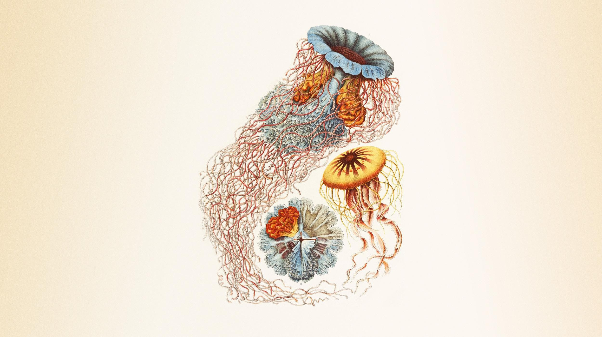
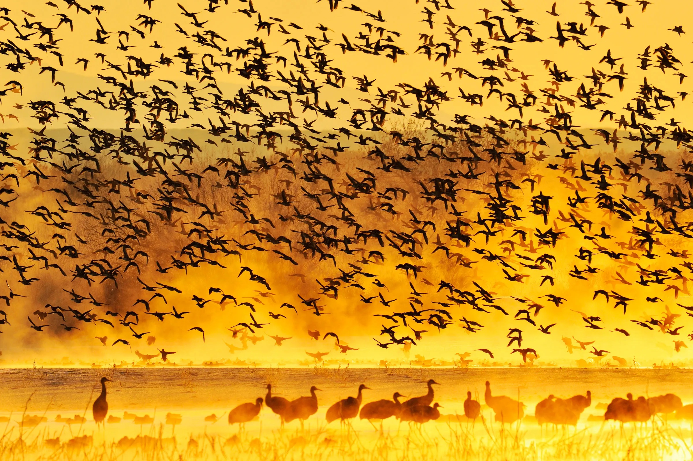
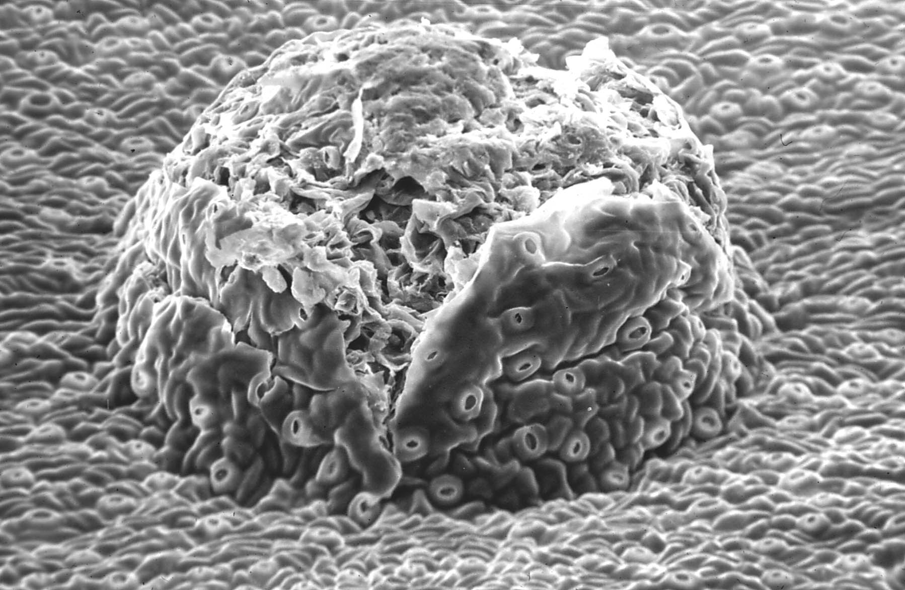
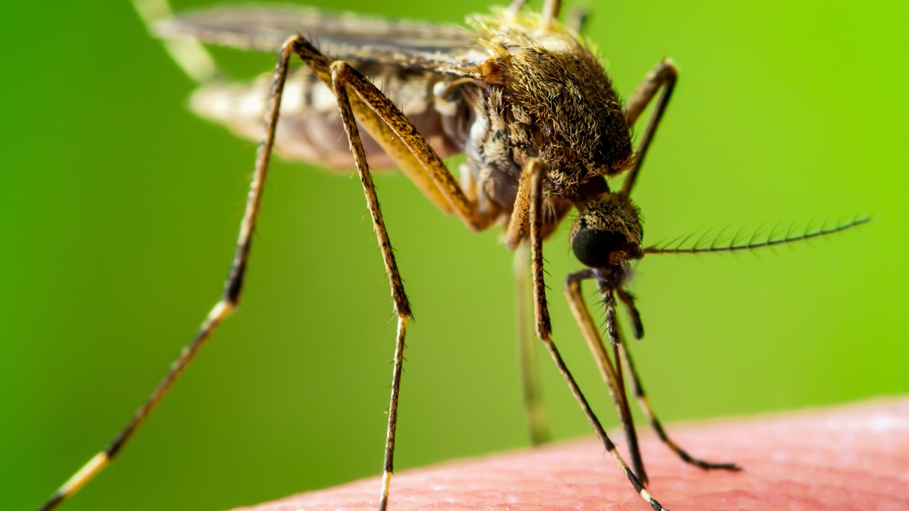

---
output:
  html_document: default
---

# Statistical modeling in biology {#chap1}

{width="120%"}

## Course description

Our understanding of biology is uncertain because biological systems are subject to stochasticity, and because our ability to quantitatively observe biological systems is imperfect. Statistical modeling is *the* approach that allows us to 'peer through' (and quantify) this uncertainty to understand how biological systems work. Therefore, the goal of this course is to provide you with a solid foundation in statistical modeling in a biological context. We will cover some basic probability (the 'language' of uncertainty) in the context of methods of estimation (least squares and maximum likelihood) and we will then begin with a deep dive into simple linear regression models assuming Gaussian ('normal') errors and including both continuous and categorical predictor variables. We will then build on this foundation by learning how to fit statistical models to data with non-Gaussian errors via so-called generalized linear models (GLMs). Next we will learn methods to account for correlation/non-independence in data by including so-called random effects in our statistical models (i.e. we will learn mixed/multilevel/hierarchical modeling). Finally, we will introduce an alternative statistical philosophy and modeling approach based on Bayesian (rather than Frequentist) statistical methods.

The course will be very applied, providing lots of opportunities to learn by doing. An important focus of the course will be to develop an intuition for the iterative process of statistical modeling from question or hypothesis through data exploration, model fitting, model diagnostics, model selection, and visualization, interpretation and presentation of results. Indeed, much of the labyrinthine 'river-delta-like' world of statistical modeling can be navigated by carefully implementing a relatively consistent modeling process. Once you become comfortable with the process, you can problem solve the details and continue to deepen your understanding of statistical modeling for the rest of your career in quantitative biology.

## Course delivery

You will learn statistical modeling in this course via a combination of guided, independent learning and face-to-face problem-based learning (practicals).

This online handbook will be your primary resource for this course, and in particular, for the guided, independent-learning content. As you will see (and consistent with other courses in the QBIOL program), the material in this online handbook will include mini-lectures, written descriptions and explanations, R code, references and assigned reading, and exercises and problems to solve. Each week, there will be new material assigned, and it is your responsibility to work through this assigned material before the practical class for QBIO7005, which is on Thursday between 0900 and 1100.

Consistent with other courses in the QBIOL program, we recommend working through the content in this handbook for each week no later than Wednesday afternoons (\~3 hours), which will mean you are well prepared for the practical on Thursday morning. After the practical on Thursday, we recommend spending another hour or so going through all the content for that week so that it really starts to make sense.

## VENUE AND ZOOM LINK!

Practicals will be live and face to face in room 385 from 9am to 11am on Thursdays, and will be broadcast simultaneously at https://uqz.zoom.us/j/89097393588

{width="100%"}

## Course content, week-by-week

+-----------------+------------------+-----------------------------------------------------------------------------------------------------------------------------------------------------------------------------------------------------------------------------------------+-----------------+
| week            | date             | topic                                                                                                                                                                                                                                   | person          |
+:================+:=================+:========================================================================================================================================================================================================================================+:================+
| 1               | Thur 24 February | Goals of statistical modeling, structure of a statistical model, methods of estimation, simple linear regression with Gaussian errors                                                                                                   | Simon Hart      |
+-----------------+------------------+-----------------------------------------------------------------------------------------------------------------------------------------------------------------------------------------------------------------------------------------+-----------------+
| 2               | Thur 10 March    | Simple and multiple linear regression with Gaussian errors and continuous and categorical predictors, model assumptions, collinearity, model selection and hypothesis testing, visualization and interpretation.                        | Simon Hart      |
+-----------------+------------------+-----------------------------------------------------------------------------------------------------------------------------------------------------------------------------------------------------------------------------------------+-----------------+
| 3               | Thur 17 March    | Regression with Gaussian errors (continued),                                                                                                                                                                                            | Simon Hart      |
+-----------------+------------------+-----------------------------------------------------------------------------------------------------------------------------------------------------------------------------------------------------------------------------------------+-----------------+
| 4               | Thur 24 March    | Statistical models for data with non-Gaussian errors (Generalized Linear Models [GLMs]), logistic regression                                                                                                                            | Simon Hart      |
+-----------------+------------------+-----------------------------------------------------------------------------------------------------------------------------------------------------------------------------------------------------------------------------------------+-----------------+
| 5               | Thur 31 March    | GLMs (continued), and perhaps some celebratory cake for getting through half the course!                                                                                                                                                | Simon Hart      |
+-----------------+------------------+-----------------------------------------------------------------------------------------------------------------------------------------------------------------------------------------------------------------------------------------+-----------------+
| 6               | Thur 7 April     | Statistical modeling of correlated/non-independent data using mixed/multilevel/hierarchical models                                                                                                                                      | Simone Blomberg |
+-----------------+------------------+-----------------------------------------------------------------------------------------------------------------------------------------------------------------------------------------------------------------------------------------+-----------------+
| 7               | Thur 13 May      | Mixed/multilevel/hierarchical models (continued)                                                                                                                                                                                        | Simone Blomberg |
+-----------------+------------------+-----------------------------------------------------------------------------------------------------------------------------------------------------------------------------------------------------------------------------------------+-----------------+
| BIG GAP!        |                  |                                                                                                                                                                                                                                         |                 |
+-----------------+------------------+-----------------------------------------------------------------------------------------------------------------------------------------------------------------------------------------------------------------------------------------+-----------------+
| 8               | Thur 19 May      | Mixed/hierarchical/multilevel models (continued)                                                                                                                                                                                        | Simone Blomberg |
+-----------------+------------------+-----------------------------------------------------------------------------------------------------------------------------------------------------------------------------------------------------------------------------------------+-----------------+
| 9               | Thur 26 May      | Statistical modeling using Bayesian methods                                                                                                                                                                                             | Simone Blomberg |
+-----------------+------------------+-----------------------------------------------------------------------------------------------------------------------------------------------------------------------------------------------------------------------------------------+-----------------+
| 10              | Thur 02 June     | Statistical modeling using Bayesian methods                                                                                                                                                                                            | Simone Blomberg |
+-----------------+------------------+-----------------------------------------------------------------------------------------------------------------------------------------------------------------------------------------------------------------------------------------+-----------------+

## Textbooks and Resources

Where to start?

There are an endless number of texts and online resources for building your understanding of statistical modeling. We personally draw on many resources, and speaking personally I (Simon) really benefit from trying to understand a single concept with reference to many different resources. 

There is no set text or resource, but some we have found to be helpful include: 

Bolker, B. M. 2008. Ecological models and data in R. Princeton University Press.

Gelman, & Hill, J. 2007. Data analysis using regression and multilevel/hierarchical models. Cambridge University Press.

Gelman, A., Hill, J., & Vehtari, A. 2020. Regression and Other Stories (Analytical Methods for Social Research). Cambridge: Cambridge University Press. 

Kruschke, J.R. 2014. Doing Bayesian Data Analysis. Elsevier Science & Technology.

McElreath, R. 2016. Statistical rethinking: a Bayesian course with examples in R and Stan. CRC Press/Taylor & Francis Group.

Quinn, G. P., and M. J. Keough. 2002. Experimental Design and Data Analysis for Biologists. Cambridge University Press.

Sokal, & Rohlf, F. J. 2012. Biometry: the principles and practice of statistics in biological research (4th ed.). W.H. Freeman.

Many of these are available in the library (including online). This is such a small sample, but it will get you a long way. But I would encourage you to read widely, and read about the same topic in different texts.  

You should also use your online searching skills. You will often find your statistics and R questions addressed on StackOverflow and StackExchange, and there are some great presenters on YouTube covering a lot of material on statistics. You can often find examples and explanations pitched at just the right level for your understanding.

## Assessment

**Assignments**

There will be four assignments in this course, each worth 25%. There will be one assignment for each of the four broad themes we will cover in this course: 1) linear models with Gaussian errors, 2) generalized linear models (i.e. linear models accommodating non-Gaussian errors), 3) multilevel/hierarchical/mixed models, and 4) Bayesian analyses. 

For each assignment, you will be provided with a biological problem and a dataset. In general terms for each assignment you will be required to: a) build an appropriate statistical model, b) implement the model in R, c) evaluate and refit the model as required, d) appropriately present and interpret the results of the final model, and e) present evidence of using appropriate tools for model evaluation and interpretation.

Each assignment will be submitted as a short report with a description of the background and scientific question, analytical methods, analytical results (including figures), and a brief written interpretation and conclusion based on the analytical results. 

Each assignment will be given a grade out of 25, based on building, implementing (in R), evaluating, and presenting the results of an appropriate statistical model.

These assignments are designed to replicate a situation that you will encounter in your career in Quantitative Biology - that is, you will need to solve a  statistical problem in your own research, or you will be given a problem by a client or boss or collaborator, and you will need to analyse and interpret the data appropriately, and provide them with an 'answer'. That is, these assignments are 'authentic' assessment tasks. 

Assignments should be submitted via TurnItIn. The due dates are as follows:

Assignment                      due date and time   
------------------------        -------------------------------------------  
1. Multiple regression          Friday 1st April, 1400
2. Generalized Linear Model(s)  Friday 14th April, 1400  
3. Multilevel model(s)          Friday 20th May, 1400
4. Bayesian analysis            Friday 17th June, 1400

\
\

## Biology in this course

{width="100%"}

QBIO7005 is part of the Quantitative *Biology* program. There is so much content to cover that we could teach you both biology and statistical modeling for years... but, unfortunately, we just don't have that luxury. In this course we unashamedly prioritize the teaching of statistical methods over the teaching of cutting-edge biology. To learn the statistical methods we will tend to use biological examples, and we will include some 'biological vignettes' to expose you to core questions/problems in the biological sciences. However, on 'average' we think that in this course you will be best served by developing a deep understanding of statistical modeling over a deep understanding of biology. If you understand statistical modeling you can use these tools to understand biology for the rest of your life, but the converse is not true. All I remember when being taught how to understand and analyse 'Randomized Complete Block' designs is that I did not understand the biological example (mites living in domatia on leaves), which means I was never going to understand the statistics. We want to avoid that outcome in this course as much as possible. This will sometimes (often) mean that we will use simple biological examples so that you can learn the fundamental principles of statistical modeling, but without these principles being obscured by complicated biological examples. 

Despite taking this approach, this course will focus on statistical issues that commonly arise when addressing biological problems and dealing with biological data - including different data structures, non-independence, collinearity, overfitting, estimation and hypothesis testing, etc. We can't cover all the issues arising in biological data - sorry (!) - but we will cover a lot.  

Finally on this point, we (and the rest of the QBIOL team and members of the School of Biological Sciences) can talk about interesting biology whenever you like. And there will also always be opportunities to apply your understanding of statistical methods to more complex biological problems.

## Goals and expectations

**Our (Simon's and Simone's) goals for QBIO7005 are to:**

-   teach you the concepts and skills to pass this course to the level you are able and desire

-   teach you the concepts and skills to be a confident applied statistician. This confidence will not only be based on the specific statistical skills that you learn in this course, but we also aim to teach you an approach to the statistical-modeling world, and the modeling process, that will enable to you to understand new techniques and new problems throughout your career.

Another goal of ours is to deepen our own knowledge of statistical methods so that we can continue to improve our teaching, and our own application of statistical methods to understand our biological world.* To that end, challenge us! Poke holes in our explanations and understanding. I guarantee we will not know all the answers and all the answers are not always on the tip of our tongue. Your poking will only help us all learn (and remember) so much more. And embrace the uncertainty and spontaneity - use it to spur your own exploration and learning. That is what learning is all about.\
\
**What you can expect from us:**

-   The course will be well organized. You will know what you need to learn and when.

-   We will make sure you have all the information and support you need to pass the course, and assessable material will be made clear.

-   We will try to make the subject material clear, interesting, engaging, and useful.

-   Each week's material in the online handbook will be available by Monday afternoon prior to Thursday's practical.

-   We will make ourselves available for in-person and Zoom consultation for ~30 minutes before and after each  practical.

-   We will respond to all substantive questions, queries, and concerns respectfully 

-   We will fix problems and rapidly adjust our teaching in response to constructive, timely feedback.

-   We will take the time to get to know you!\
    \

**Exercise** **What would you like to get out of this course?**\
Please let us know here:

{width="20%"}

We might have a quick chat about your own personal experiences with statistical modeling, and your goals for this course in the face-to-face session on Thursday.\
\

**At the very least, we hope that your goals for QBIO7005 include:**

-   learn the concepts and skills to pass this course to the level you are able and desire

-   learn the concepts and skills to be a confident applied statistician.\
    \

**What we hope we can expect from you:**

-   Use your initiative, intelligence, self-discipline, curiosity and vested interest to take responsibility for your own learning.

-   Complete the guided, independent-learning before the practical each week.

-   Attend and participate in the practicals.

-   Complete assessments on time.

-   Take your own notes.

-   Use email sparingly, and be courteous and polite.

-   Ask questions (publicly, privately, anonymously) if you don't understand, can't see or hear, suspect or find an error, etc.

-   If we can improve something about our teaching or the course, let us know early because we will fix it if we can (SECaTs are good for us and for students next year, but they occur too late to benefit you).

-   If you have a problem, let us know early and propose a solution if possible.\
    \

{width="120%"}

## Course communication

You should have received an invitation to the QBIOL Slack group, and should have access to the QBIO7005 channel. For our course we would encourage you to use Slack to communicate and solve problems together as a student cohort. More generally, we would encourage you to work *together* on the course content - whether using Slack or Zoom or sitting together in the library or a cafe - as you will likely learn more and have more fun learning as well.

It is not possible for us (Simon and Simone) to constantly monitor Slack. Instead, in QBIO7005 we have decided to prioritize additional face-to-face time to provide additional help with the course content. It is for this reason that we are making ourselves available for an extra 30 minutes before and after each practical session to cover specific questions or issues. Outside of this time please communicate to Simon and Simone via email, which we find to be the least disruptive, one-stop-shop method of electronic communication. Please use sparingly - i.e. only for substantive questions or concerns. We will also send important notifications to all students using email.

Our email addresses are:\
Simon [s.hart\@uq.edu.au](mailto:s.hart@uq.edu.au){.email}\
Simone [s.blomberg1\@uq.edu.au](mailto:s.blomberg1@uq.edu.au){.email}

\

## And finally...

[This is a safe, encouraging space to learn.]{style="font-size:1.5em;"}\
[Dissent backed by evidence is welcome.]{style="font-size:1.5em;"}
