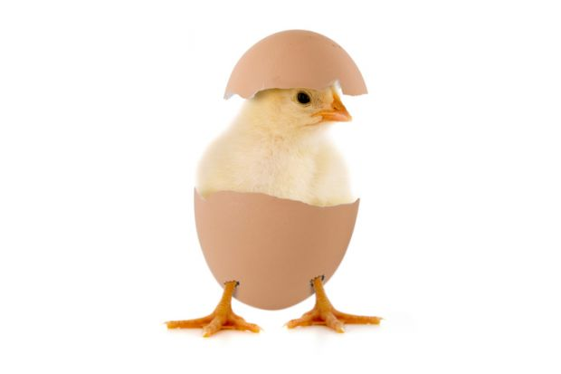

---
output:
  pdf_document: default
  html_document: default
---
# What is statistical modeling? And why do we need it?{#chap2}

## Why do we need statistical modeling?

You've all done some statistics. Have you ever thought deeply about why we actually _need_ statistics? Many textbooks gloss over the reasons why we actually need statistics, and just plunge in to the details of probability theory (coin tossing, anyone? set theory, anyone?), etc. Don't get me wrong, you need to understand some probability to understand statistics, but why do we actually need statistical modeling in the first place? 

<span style="color: red;">**Exercise**</span> Before watching the first 'mini-lecture' (below), take a moment to write two or three short statements describing exactly why you think we need statistical modeling? Try not to be too vague. Why exactly do we need statistical modeling to understand how our biological world works? We will go over your thoughts in the face-to-face session on Thursday\
\

<center>QBIO7005 MiniLecture_01 Why do we need statistical modeling?</center>\
<center><iframe width="560" height="315" src="https://www.youtube.com/embed/LVSQuoqqcG8" title="YouTube video player" frameborder="0" allow="accelerometer; autoplay; clipboard-write; encrypted-media; gyroscope; picture-in-picture" allowfullscreen></iframe></center>


## Learning statistical modeling

<center>{width=50%}</center>
\

Truly understanding the art and science of statistical modeling is really a career-long endeavor, one that can be surprisingly satisfying and rewarding. In many respects, learning statistics is like peeling back the layers of an onion. But that only partially captures the process. One of the enduring challenges of learning statistical modeling is that the learning becomes a chicken-and-egg problem. To quote Bolker (2008) (\@ref(textbooks-and-resources)): "to know why certain technical details are important, you need to know the big picture, but the big picture itself involves knowing some of those technical details." 
\
\
<center>{width=50%}</center>

We will try to introduce material progressively, and by first providing high-level context for the lower-level technical details. But in this course this chicken-and-egg problem starts now. As you move through this course (and to quote Bolker again): "Iterating, or cycling [back through earlier material], is the best way to handle this problem." And, even if you don't understand the context of what you are learning right now, have faith that those details are likely to make sense at some point in the future. 
\

## What is a statistical model (part 1)? 

Your understanding of what a statistical model is, and what features of both data and biology can be accommodated and included, will develop over time. But let us start with some basics:
\
\
<center><iframe width="560" height="315" src="https://www.youtube.com/embed/LbRh__ZtB6k" title="YouTube video player" frameborder="0" allow="accelerometer; autoplay; clipboard-write; encrypted-media; gyroscope; picture-in-picture" allowfullscreen></iframe></center>
\


## "Lies, damned lies, and statistics". A note on motivation and ethics. 

Statistical modeling can be a powerful way to understand how our (biological) world works. But done badly - whether through  benign or malignant neglect - statistical modeling can be powerfully misleading, leading to the famous statement sometimes attributed to Mark Twain: "There are three kinds of lies: lies, damned lies, and statistics."

There is no doubt that the process of statistical modeling can be consciously manipulated to give the impression of a result that may not be true. To avoid this problem in your own work you need to draw on your own moral principles.

I hope that for most people the more problematic issue is that statistical modeling will nearly always give you an 'answer', but this answer might not be a true reflection of reality because of, among other things, inexperience, or decisions and/or mistakes made during the modeling (and pre-modeling) process. Therefore, doing statistical modeling well will always require a good dose of humility. 

<center>{width=40%}</center>


Here is a high-profile, non-biological example of the consequences of making a presumably innocent mistake in statistical modeling: [preventable disaster!](https://tinyurl.com/bdh4xxhz){target="_blank"} (We will cover techniques to analyze similar data in a few weeks, but for now, reading down to the paragraph beginning "Instead of trying to predict the number of incidents...", will give you a good enough understanding of the seemingly benign mistake leading to such a dramatic outcome). The modern biological sciences are almost undoubtedly riddled with similar statistical mistakes with who knows what consequences for our understanding of the world. 

Ultimately, all these issues can be overcome, I think, by having the right motivation. To be a great statistician **you need to want to know the real answer. You need to want to give yourself the best chance of knowing how the real world actually works**. Understanding the mechanics of statistical modeling is worth almost nothing unless it is backed up with the right motivation. With the right motivation, you can more effectively avoid the pitfalls of statistical modeling, while leveraging all its power.  


## (Very) basic structure of a statistical model

Before we can understand some of the goals of statistical modeling, it will be useful to understand a little more about the structure of a 'standard' statistical model. We will also progressively introduce more and more terminology, remembering that a big part of learning a new discipline is to become more and more familiar with the language of the discipline. 
\
\

<center><iframe width="560" height="315" src="https://www.youtube.com/embed/_ZQUFodLQMU" title="YouTube video player" frameborder="0" allow="accelerometer; autoplay; clipboard-write; encrypted-media; gyroscope; picture-in-picture" allowfullscreen></iframe></center>

\

## Goals of statistical modeling 

So, we know why we need to statistical modeling, and we have some idea of the structure of a statistical model. It is also important to understand the goals of statistical modeling. This wouldn't be so important if there was just one goal, but statistical modeling can be motivated by different goals. To give you an overview of the some of the more common goals of statistical modeling:
\
\

<center><iframe width="560" height="315" src="https://www.youtube.com/embed/TC-J58ngc0w" title="YouTube video player" frameborder="0" allow="accelerometer; autoplay; clipboard-write; encrypted-media; gyroscope; picture-in-picture" allowfullscreen></iframe></center>
\

## A note on the challenge and limits of statistical modeling

We just spent a little time on the goals of statistical modeling. Remember that 'achieving' these goals by doing a good job constructing a statistical model does not necessarily mean your conclusions will translate to the world beyond the model. (The following is an excerpt from McElreath's book on Bayesian data analysis (\@ref(textbooks-and-resources)), but the same sentiment applies regardless of the statistical/philosophical framework you are using)

```{r out.height = "850px", out.width='750px', echo=F}
knitr::include_graphics("pics/SmallWorldsLargeWorlds.pdf")
```


