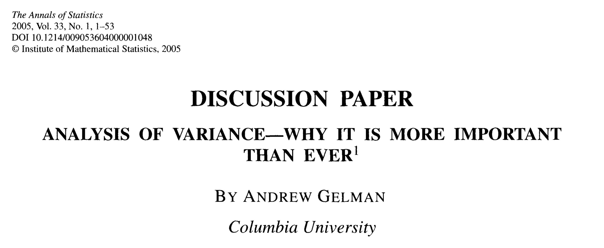
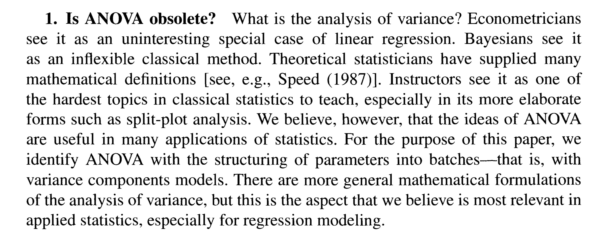
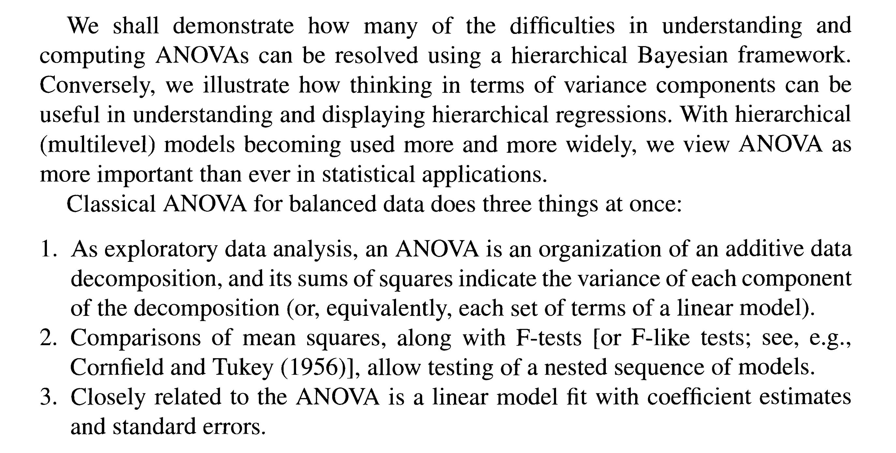

# Hypothesis testing for regression {#chap5}

## Statistical hypothesis testing using ANOVA

### A little background

What is a statistical hypothesis test? I'm just going to do what we all do these days - go straight to Wikipedia (!): 

>"A statistical hypothesis test is a method of statistical inference used to determine a possible conclusion from two [or several] different, and likely conflicting, hypotheses."

One key part of this sentence is "...to determine a possible conclusion...". The idea behind statistically testing a hypothesis is that ideally it will give us quantitative information on which we can make a clear _decision_ about how the world works. For example - does our independent variable affect our dependent variable, or not? Are you happy or not?\

<center>{width="80%"}</center>\

Using statistics to make a decision between alternatives is, I think, the source of the power of hypothesis testing, but also the source of its problems. You will read about some of these problems a little later, but for now - let's just do some hypothesis testing. 

### Statistical hypotheses

To motivate the basic methods behind hypothesis testing, at this early stage of the course let's focus on the most basic hypothesis test for a simple (i.e. one predictor variable) linear regression model. In broad terms we want to know if anything is going on. That is, we want to know if our response variable 'depends' on our explanatory variable? In this context one possibility for the "two different, likely conflicting, hypotheses" in Wikipedia's definition (above) are a _null hypothesis_ that nothing is going on and an _alternative hypothesis_ that something is going on. That is, our response variable either does not depend on our explanatory variable (null hypothesis) or it does depend on our explanatory variable (alternative hypothesis). Note that we are not restricted to a null hypothesis of 'no effect'. We could, for example, compare the hypotheses that the dependence of our response variable on our explanatory variable is positive vs. negative, or has a slope of 10 vs. 20, etc. So when our scientific theories, data quality, and investigation goals warrant, we can test more sophisticated hypotheses. But for now, we will do a more classical hypothesis test, with a null hypothesis of 'no effect'. (I can already hear the critics of "Null Hypothesis Significance Testing" [or NHST] screaming! But we will ignore the screams for now).

### Partitioning variation 

#### Do I really need to know this? Isn't ANOVA dead?

We will (first) test our hypothesis using analysis of variance or 'ANOVA'. ANOVA is a 'classical' statistical method built on the foundations of the work of formidable mathematicians (e.g. Laplace and Gauss), and then developed and popularized from the 1920s by [Ronald A. Fisher](https://en.wikipedia.org/wiki/Ronald_Fisher){target="_blank"}, a man who made enormous contributions to mathematics, statistics and genetics, and who also had some abhorrent views on race. ANOVA, particularly for hypothesis testing, is now considered by some to be an old-fashioned even outdated method for making statistical inference. But even if this is the case (and many don't think it is - including me), the method of partitioning variation in statistical analyses - regardless of your philosophical views on different approaches to statistics - is extremely general. For example, a famous and famously progressive statistician, who advocates strongly for Bayesian analytical approaches and tends to discount the value of hypothesis testing for statistical inference, has this to say about ANOVA:

<center>{width="85%"}</center>\
<center>{width="85%"}</center>\
<center>{width="85%"}</center>\

I don't expect you to understand all this, although some key words may jump out and will certainly become familiar as we work through this chapter (e.g. sums of squares, variance, mean squares, F-tests, variance decomposition). But regardless of your developing views on statistical philosophies (Frequentist, Bayesian, etc.) or your views on the value of hypothesis tests (more to come on this), understanding the concepts behind and details of partitioning variation into different components via ANOVA will continue to be very useful for you as you develop as an applied biological statistician.

#### Ok, so I need to know this. What next?

Before we can test this hypothesis we need to revisit the idea of partitioning the total variation in the response variable into the part due to the relationship with our predictor variable, and the part not explained by the relationship with our predictor variable. 

Recall this set of plots, showing how we can decompose the total variation (left plot) in our data into the variation explained by our predictor variable (centre plot) and the remaining unexplained variation (right plot).

```{r eval=T, results='hide',include=F}
d1 <- read.table("TemperatureGrowth.txt",header=T)
str(d1)
summary(d1)
```

```{r eval=T, results='hide',include=F}
model <- lm(growthrate~temperature, data=d1)
```

```{r eval=T,echo=F}
library(latex2exp)
par(mfrow=c(1,3))
plot(growthrate~temperature, data=d1,xlab="X",ylab="Y",main="Total variation")
abline(h=mean(d1$growthrate),lwd=2)
arrows(x0=d1$temperature,x1=d1$temperature,y0=rep(mean(d1$growthrate),length(d1$temperature)),y1=d1$growthrate,code = 0)
# legend("topleft",legend = "Total variation",bty='n')

plot(growthrate~temperature, data=d1,xlab="X",ylab="Y",main="Explained variation")
abline(h=mean(d1$growthrate),lwd=2)
abline(model,lwd=1,lty=3)
points(x = d1$temperature,y=fitted(model),pch=16)
arrows(x0=d1$temperature,x1=d1$temperature,y0=rep(mean(d1$growthrate),length(d1$temperature)),y1=fitted(model),code = 0)
# legend("topleft",legend = "Explained variation",bty='n')

plot(growthrate~temperature, data=d1,xlab="X",ylab="Y",main="Unexplained variation")
abline(model)
arrows(x0=d1$temperature,x1=d1$temperature,y0=d1$growthrate,y1=fitted(model),code = 0)
# legend("topleft",legend = "Unexplained variation",bty='n')
```

We have been describing how we can decompose the total variation in our data, and we have been 'defining' the different sources of variation (explained [=effect of X]) and unexplained or residual) using sums of the squared deviations (or SS), where the deviations are defined with respect to different reference points (i.e. the mean value of the response variable [centre plot] or the fitted regression line [right plot]). Remember also that the sums of the squared deviations from the different sources themselves sum together to give the total sums of the squared deviations:

$SS_{\textrm{total}} = SS_{\textrm{effect of X}} + SS_{\textrm{residual}}$

It is important to note that while sums of squared deviations are a measure of variation, this measure will always increase with increasing numbers of observations. If you have an extra observation then this can only add to the value of an SS, because you are adding a new positive number to your total. That is, sums of squared deviations are dependent on the numbers of observations used to calculate them. By contrast, a variance - which is just the _mean of a sum of the squared deviations_ - is a measure of variability that does not depend on observation number (because it is an 'average' and when you calculate an average its value does not necessarily go up if you have more observations). This is one reason why describing sources of variation in our data in terms of variances (or 'mean squares' or MS) rather than 'sums of squares' (or SS) becomes useful for hypothesis testing. 

How do we convert sums of squared deviations (SS) into mean squares (MS) (which are just variances) associated with our explanatory variable, and the remaining unexplained variation? Well, just like a normal arithmetic average, or mean, we divide each SS by the number of independent 'pieces of information' that contribute to the value of the SS. In short, we divide by the _degrees of freedom_ associated with each SS. 

#### Degrees of freedom interlude
\

<center>Some interlude music for your interlude:</center>
<center><audio controls>
  <source src="The_Avalanches_Little_Journey.mp3" type="audio/mpeg">
Your browser does not support the audio element.
</audio></center>
\

While critically important to statistical methods, the concept of degrees of freedom can be difficult to understand. But in very general non-mathy terms what we are interested in is the number of independent pieces of information required to calculate a quantity. Think about a rectangle with two sides $x$ and $y$. These are our 'pieces of information'. And the quantity we are thinking about is the rectangle's area, $A$, which takes some real value (not real as in a $\mathbb R$ number but real as in a value that actually exists). We all know the equation for the area of a rectangle: $x \times y=A$. If $A$ takes some 'real' fixed value, then knowing the value of $x$ means that $y$ is constrained to take a particular value. For example, if $A=6$ and we determine that $x=2$, then $y$ is no longer 'free to vary' - it must take the value $3$ if $A=6$. In this illustration of the idea of degrees of freedom, only one 'piece of information' is free to vary. Once we know one 'piece of information', say $x$, the other piece of information, $y$, is constrained to take a certain value. Please be aware that all I have done here is to try to give you an intuitive understanding of the concept of degrees of freedom. As far as I am aware, the concept of degrees of freedom is not formally used with respect to rectangle areas. 

I often find it useful to resolve and reinforce my understanding of statistical issues by seeking out different descriptions of the same concept. In that spirit I'm going to try to give you another similar explanation (based on intuition rather than a lot of math), taken from [here](https://stats.stackexchange.com/questions/16921/how-to-understand-degrees-of-freedom/16931#16931){target="_blank"}:

>"...suppose you have four variables: the length, the width, the area, and the perimeter of a rectangle. Do you really know four things? No, because there are only two degrees of freedom. If you know the length and the width, you can derive the area and the perimeter. If you know the length and the area, you can derive the width and the perimeter. If you know the area and the perimeter you can derive the length and the width (up to rotation). If you have all four, you can either say that the system is consistent (all of the variables agree with each other), or inconsistent (no rectangle could actually satisfy all of the conditions). A square is a rectangle with a degree of freedom removed; if you know any side of a square or its perimeter or its area, you can derive all of the others because there's only one degree of freedom.

>In statistics, things get more fuzzy, but the idea is still the same. If all of the data that you're using as the input for a function are independent variables, then you have as many degrees of freedom as you have inputs. But if they have dependence in some way, such that if you had n - k inputs you could figure out the remaining k, then you've actually only got n - k degrees of freedom. And sometimes you need to take that into account, lest you convince yourself that the data are more reliable or have more predictive power than they really do, by counting more data points than you really have independent bits of data."

In the context of decomposing the variation in the data for hypothesis testing, we need to estimate sample variances (which, to drive it home, are means of the sums of the squared deviations or mean squares (MS) for short). To reinforce the conceptual explanation of degrees of freedom above but in the context of variances have a read of Box 2.1 from Quinn and Keough 2002: 

<center> copy.jpg){width="65%"}</center>


### Calculating variances

Now we need to relate this to calculating a bunch of variances. The total variance associated with our sample is:

$\frac{\Sigma_{i=1}^n(y_{i}-\bar{y})^2}{n-1}=\frac{SS_{\textrm{total}}}{\textrm{df}_\textrm{total}}=\hat{\sigma}^2_{\textrm{data}}= {\textrm{the variance of the data}}$

where $n-1$ is the degrees of freedom associated with $SS_{\textrm{total}}$. That is, when calculating $SS_{\textrm{total}}$, only $n-1$ 'pieces of information' are free to vary. 

The next variance you are already familiar with. It is the variance associated with the residuals, which estimates the standard deviation parameter (i.e. $\sigma$) of the normal distribution of our statistical model (remembering that a standard deviation is a square root of a variance) (see \@ref(eq:m1)). 

$\frac{\Sigma_{i=1}^n(y_{i}-\hat{y})^2}{n-\textrm{number of model coefficients}}=\frac{SS_{\textrm{residual}}}{\textrm{df}_\textrm{residual}}=\hat{\sigma}^2_{\textrm{residual}}= {\textrm{the variance of the residuals}}$

In simple linear regression, the residual variance describes the variance of the observed $y$-values at each value of $x$. This is not saying anything that we have not already covered. 

The final variance we need to calculate is: 

$\frac{\Sigma_{i=1}^n(\hat{y}_{i}-\bar{y})^2}{\textrm{number of model coefficients - 1}}=\frac{SS_{\textrm{regression}}}{\textrm{df}_\textrm{regression}}=\hat{\sigma}^2_{\textrm{regression}}$

First, why are the degrees of freedom here equal to "$\textrm{number of coefficients - 1}$"? This might be a little hard to get your head around (it is for me), but let's try. We might think that the $SS_{\textrm{regression}}$ requires information from all our data - but it doesn't really. The fitted values all fall along a common line, and so now reflect just two independent 'pieces of information' derived from the data - the intercept $\beta_0$ and the slope $\beta_1$. As shown in the equation above, to calculate $SS_{\textrm{regression}}$ we also need one additional 'piece of information', which is the overall (or grand) mean of the data, $\bar{y}$. But we already know this because it is 'fixed' by the  $SS_{\textrm{total}}$. So to calculate $SS_{\textrm{regression}}$ we need three 'pieces of information' in total, but we already know one 'piece of information' (($\bar{y}$) from $SS_{\textrm{total}}$), leaving the remaining two 'pieces of information - the slope and intercept. Then, based on what you now know about degrees of freedom, once we know the intercept $B_0$, the slope (or, equivalently, the effect of $x$) is no longer 'free to vary'. Clear as mud? 

Unfortunately, it's not going to get any easier for a bit. And I'm sure you're wondering where we are going with all this. But let's plough on.

What we have just calculated are all 'sample variances'. And each of these sample variances is our best estimate of the true variance of a population. This is easiest to understand with respect to $\hat{\sigma}^2_{\textrm{data}}$. This is the variance of the data. The data itself are a _sample_ from a population (and so subject to sampling error). For the iKung San height data, for example, we didn't measure the height of every single person (i.e. the whole population), we just measured the height of a sample of persons from the population. If we did measure the height of every single person in the population (and assuming no measurement error) we would be able to calculate the _true_ variance of their heights. But because we just measured our sample, we can only _estimate_ the true variance. $\hat{\sigma}^2_{\textrm{data}}$ is our estimate of the true variance, $\sigma^2$. 

The other variances we just calculated, $\hat{\sigma}^2_{\textrm{residual}}$ and $\hat{\sigma}^2_{\textrm{regression}}$ are also sample variances that estimate true variances. But what are these true variances that they are estimating? Well $\hat{\sigma}^2_{\textrm{residual}}$ estimates the true variance of the _entire population_ of $y$-values at each value of $x$ (i.e. $\sigma^2_{\epsilon}$). Not so hard. 

But now take a deep breath, because things get a bit weird. Statisticians have determined that $\hat{\sigma}^2_{\textrm{regression}}$ estimates the true variance of the entire population of $y$-values at each value of $x$ (yes this _is_ $\sigma^2_{\epsilon}$ - you read that right) **_plus_** an additional source of variation determined by the strength of the absolute relationship between $y$ and $x$. Or more formally:

$\hat{\sigma}^2_{\textrm{regression}}$ estimates $\sigma^2_{\epsilon}+\beta^2_1(\Sigma^n_{i=1}(x_i-\bar{x}^2))$

How people way smarter than me determined this to be the case is beyond the scope of this course. So you'll either have to trust me, or go look it up if you would like to go deeper. If you are willing to trust me then fortunately things now become simpler to understand, and can mostly be understood conceptually rather than mathematically. 

### How does all this relate to hypothesis testing?

Let me summarize where we are at with a table:

|<font size="0.5">Source of variation </font>|<font size="0.5">SS|<font size="0.5">df| <font size="0.5">MS|<font size="0.5">"Expected" MS|
|:--- |:--- |:--- |:--- | :--- |
|<font size="0.5">regression|<font size="0.5">$\Sigma_{i=1}^n(\hat{y}_{i}-\bar{y})^2$|<font size="0.5">$\textrm{number of model coefficients - 1}$|<font size="0.5">$\frac{\Sigma_{i=1}^n(\hat{y}_{i}-\bar{y})^2}{\textrm{df}_{\textrm{regression}}}$|<font size="0.5">$\sigma^2_{\epsilon}+\beta^2_1(\Sigma^n_{i=1}(x_i-\bar{x}^2))$|
|<font size="0.5">residual|<font size="0.5">$\Sigma_{i=1}^n({y}_{i}-\hat{y}_{i})^2$|<font size="0.5">$n-\textrm{number of model coefficients}$|<font size="0.5">$\frac{\Sigma_{i=1}^n({y}_{i}-\hat{y}_{i})^2}{\textrm{df}_{\textrm{residual}}}$|<font size="0.5">$\sigma^2_{\epsilon}$|
|<font size="0.5">total|<font size="0.5">$\Sigma_{i=1}^n({y}_{i}-\bar{y})^2$|<font size="0.5">$n-1$|<font size="0.5">$\frac{\Sigma_{i=1}^n({y}_{i}-\bar{y})^2}{\textrm{df}_{\textrm{total}}}$|
 
This table pretty much outlines everything that we have gone through up to this point. The "Expected" in ""Expected MS"" is a formal way of saying this is the actual variance that would be expected if our variances were not calculated from a sample. That is, these are the population variances that our MS are estimating.

Now remember that the null hypothesis that we are testing is that the slope of the regression line, $\beta_{1}$, equals zero, which is the same as saying that $x$ has no effect on $y$. If $\beta_{1}$ actually does equal zero then the second term of the regression expected mean square would necessarily be equal to zero (i.e. letting $\beta_1$ in this term equal zero means that the whole second term equals zero). Under this scenario (i.e. under the scenario that the null hypothesis is true) it becomes clear that the $MS_{\textrm{regression}}$ and the $MS_{\textrm{residual}}$ both estimate $\sigma\epsilon^2$. That is, if there is no effect of $x$ on $y$ then $MS_{\textrm{regression}}$ should equal $MS_{\textrm{residual}}$, or, equivalently, $\frac{MS_{\textrm{regression}}}{MS_{\textrm{residual}}}=1$. Alternatively, if $\beta_1$ does not equal zero then $\frac{MS_{\textrm{regression}}}{MS_{\textrm{residual}}}>1$. 

Want some more music?

<center>Relax...</center>
<center><audio controls>
  <source src="01SpiegelImSpiegel.mp3" type="audio/mpeg">
Your browser does not support the audio element.
</audio></center>


### Last few technical details

There is basically just one thing left to do - determine the probability that $\frac{MS_{\textrm{regression}}}{MS_{\textrm{residual}}}=1$. If the probability that this _ratio of variances_ = 1 is high, then our data is consistent with the null hypothesis of no effect of $x$. As the probability that the ratio = 1 declines, our data become less consistent with the null hypothesis. 

How do we work out the probability that a ratio of variances = 1? We use a type of probability distribution that is known to describe the distribution of ratios of variances. This is called an _F_-distribution, and just like any other probability distribution, with some values being more common than others. So for a standard normal distribution with mean equal to zero and standard deviation equal to one, values around the mean of zero are more commonly observed than values far from the mean. Similarly, for an _F_-distribution describing the most likely values of ratios of variances that are assumed to be equal, values less than or equal to 1 are more common than values much higher than 1. So as the ratio of the sample variances gets larger and larger,  the probability that the ratio of the population variances are truly equal (and thus that the slope $\beta_1$ of the regression is actually zero) gets smaller and smaller.

To illustrate how determining the probability of an observation using a normal distribution is analogous to how we determine probabilities of a ratio of variances (an 'F-ratio') using an F-distribution, we can have a look at these cases side by side in the following figure.   

``` {r echo=T}

par(mfrow=c(1,2))

# draw a standard normal distribution and shade probability density for values greater than 2
curve(dnorm(x),-4,4,n=1000,xlab="value of x (an observation, for example)",ylab="probability density",lwd=3,col="purple",yaxt="n",main="standard normal distribution")
xx <- c(seq(2,5,by=0.02),seq(5,2,by=-0.02))
yy <- c(dnorm(x=xx[1:(length(xx)/2)]),rep(0,length(xx)/2))
polygon(x = xx,y = yy,border = NA,col="purple")

# draw an F-distribution defined by certain values for the degrees of freedom, and shade the probability density for F-ratios greater than 2
df_regression = 1
df_residual = 12
curve(df(x,df1=df_regression,df2=df_residual),0,5,n=500,xlab="value of an F ratio (a ratio of variances)",ylab="probability density",lwd=3,col="purple",yaxt="n",main="central F distribution")
xx <- c(seq(2,5,by=0.02),seq(5,2,by=-0.02))
yy <- c(df(x=xx[1:(length(xx)/2)],df1=df_regression,df2=df_residual),rep(0,length(xx)/2))
polygon(x = xx,y = yy,border = NA,col="purple")

```
\
For both the normal distribution (left) and the F-distribution (right), the shaded regions in the plots above represent the probability that an observation, x, or the value of an F-ratio, take values equal to or greater than 2. The only real difference here is that a normal distribution does a good job of describing some types of observations (e.g. distribution of adult heights in a population), while the F distribution does a good job of describing the distribution of ratios of variances. That is why we use an F-distribution to quantify the probability that the observed ratio of variances in our regression ($\frac{MS_\textrm{regresssion}}{MS_\textrm{residual}}$) is equal to one under the assumption that the population variances are truly equal. If our estimate of the regression variance $MS_\textrm{regresssion}$ is not substantially larger than our estimate of the residual variance $MS_\textrm{residual}$, then there is a high probability (a high $p$-value) that our data are consistent with the null hypothesis. By contrast, if our $MS_\textrm{regresssion}$ is much larger than $MS_\textrm{residual}$ then there would appear to be an extra contribution to the variation in the data from our predictor variable, and there is, therefore, a lower probability (a lower $p$-value) that our data are consistent with the null hypothesis.

And that, my friends, is the essence of Analysis of Variance (or ANOVA) for a simple linear regression model. Phew.

### To summarize

Our goal here is to test a statistical hypothesis. The standard (not necessarily best) approach is to test a null hypothesis that there is no effect of our predictor variable, where the alternative hypothesis is that there is an effect of our predictor variable. To do this test we calculate the variance associated with the unexplained 'residual' variation, and the variance associated with the regression. The only difference between these two variances is that the 'expected' regression variance should include a contribution due to the effect of the predictor variable. We can test whether this contribution due to the effect of the predictor variable is present by determining the probability that the ratio of the regression variance and the residual variance is equal to (or less than) 1. If the probability that these variances are equal is low, then there is a low probability that the null hypothesis is true. 


## A practical example

After all that, we can now use anova to test the (null) hypothesis that weight has no 'effect' on height using the iKung San height data. 

```{r eval=T, results=' hide',include=T,echo=T}
d <- read.csv("iKung_HeightWeight.csv")
d2 <- d[d$age>=18,]
```

```{r eval=T, results='show',include=T,echo=T}
m1 <- lm(formula = height ~ weight, data=d2) 
(m1.anova <- anova(m1))
```

The _p_-value tells us that there is a low (Frequentist) probability that the null hypothesis is true ($p < 2.2 \times 10^{-16}$). 

<span style="color: red;">**Exercise**</span> Using the information in the analysis of variance table, can you calculate $MS_{\textrm{residual}}$ to confirm it does equal 25.9 as shown? And can you also calculate the F-value to confirm it does equal 463.28 as shown?

## An alternative method

We can also test for an effect of $x$ by comparing _nested_ models. I am not going to go into as much detail here but this sort of method for determining the effect of a particular predictor variable will become more relevant and useful as our models get more complicated. 

Let's keep the description here very practical. We will continue to analyse the data on iKung San adult height. Let us first fit the model we have been analysing, which we will call the 'full model' because it contains the effect of our predictor variable, together with the unexplained variation.

```{r eval=T, results='show',include=T,echo=F}
m1 <- lm(formula = height ~ weight, data=d2)
summary(m1)
```

You can see from the model summary that we have an estimate of the intercept and slope.

We now fit a simpler 'reduced' model that excludes the predictor variable we are interested in:

```{r eval=T, results='show',include=T,echo=F}
m2 <- lm(formula = height ~ 1, data=d2)
summary(m2)
```

You can see from this model summary that we have an estimate of the intercept only. You should remember from Chapter 3 that when we want to estimate the mean of the data with no predictor variable (i.e. no $x$ variable), we use the syntax `formula = response~1` in the `lm()` command. This tells `R` to just fit an intercept, and because there is no predictor variable, the intercept is equal to an estimate of the mean of the data. 

Let us now plot the fitted lines from each of these models over our data:

```{r eval=T, results='show',include=T,echo=T}
plot(d2$height~d2$weight,ylab="Adult height (cm)",xlab="Adult weight (kg)",pch=1)
abline(a = coef(m1)[1],b=coef(m1)[2],lwd=2,col="blue")
abline(h = coef(m2)[1],lwd=2,col="red")
legend("topleft",legend = c("m1","m2"),lty=1,col=c("blue","red"),bty="n")
```

I hope that you can see that the difference between these models simply reflects the presence vs. absence of an effect of $x$. We can also see this if we describe the models in word equations

m1: $\textrm{Total variation = variation due to effect of } x + \textrm{residual variation}_{\textrm{with effect of } x}$\
m2: $\textrm{Total variation = residual variation}_{\textrm{*without* effect of } x}$\

Both models describe the same data and hence the same total variation (sums of squares), and therefore:

$SS_{\textrm{effect of } x} = SS_{\textrm{residual, model *without* effect of } x} - SS_{\textrm{residual, model with effect of } x}$\

That is, the difference between the models measures how much more variation in $y$ is explained by the full model than by the reduced model. It is, therefore, the relative magnitude of the $SS_{\textrm{regression}}$ (which equals $MS_{\textrm{regression}}$ with one degree of freedom) that we use to evaluate the null hypothesis that $\beta_1$ equals zero. So describing the $SS_{\textrm{regression}}$ or $MS_{\textrm{regression}}$ as the variation explained by the regression model is really describing the $SS_{\textrm{regression}}$ or $MS_{\textrm{regression}}$ as how much more variation in $y$ the full model explains over the reduced model.

We can do this comparison in R. Note that there are many "NA"s in our dataframe, and not equally distributed between our height and weight variables. This means when we fit our models, m1 and m2, to the data they are actually fit with different 'amounts' of data. So we need to deal with these NAs before we proceed. 

```{r eval=T, results='hide',include=T,echo=T}
d <- read.csv("iKung_HeightWeight.csv")
d2 <- d[d$age>=18,c(5,6)] # subset the dataframe to only include the height and weight variables of adults over the age of 18
d2 <- na.omit(d2) # remove the rows of the new dataframe that contain NAs.
```

Now we fit our models to the same data:

```{r eval=T, results='hide',include=T,echo=T}
m1 <- lm(formula = height ~ weight, data=d2)
m2 <- lm(formula = height ~ 1, data=d2)
```

Now we compare the fits of the two models:

```{r eval=T, results='show',include=T,echo=T}
anova(m2,m1) # reduced model before full model
```

You will notice that the SS (and therefore the MS) and our F-ratio in this table are exactly the same as when we use `anova(m1)`. That is because this is basically a different way of doing the same thing.

## Hypothesis testing by comparing likelihoods

Remember in Chapter \@ref(estimation-methods) I presented two short videos on different methods of estimation - least squares and maximum likelihood? Since then we have been forging ahead assuming our model has been fit using least squares estimation, remembering that if our residuals are normally distributed, least squares and maximum likelihood estimates are the same. Nevertheless, we could have fit our model using maximum likelihood estimation, (and we will certainly need to do this when we move away from normally distributed residuals). When we fit models using maximum likelihood we can test our hypothesis for the effect of our predictor by comparing the likelihod of a full model including our predictor variable with the likelihood of a reduced model excluding our predictor variable. We do this with a _likelihood ratio test_ (LRT):

```{r eval=T, results='show',include=T,echo=T}
anova(m2,m1,test="LRT") # reduced model before full model
```

We will leave the details for another time, although note that we are no longer using an F-statistic for our hypothesis test. It is also worthwhile noting that at least for our simple regression model here, the different statistical methods for testing the same hypothesis result in the same conclusions. 


## Issues with hypothesis testing?

Uph. Hypothesis testing. These days the phrase "hypothesis testing" sometimes feels like the dirtiest phrase in the statistical modeling world. Arguments for and against hypothesis testing continue to be made by very smart people. I am going to side step most of the controversy with: a) a quote, and b) some further reading. 

First, a quote:
\

>"If the government required statistical procedures to carry warning labels like those on drugs, most inference methods would have long labels indeed."

|               --- Moore, David (2003). Introduction to the Practice of Statistics. p. 426.
\
It is worthwhile considering that this sentiment certainly applies to hypothesis testing, but also to the alternatives to hypothesis testing. My conclusion from all this (as I noted in Chapter 2) is that doing statistical modeling well always requires a lot of humility. 

\
Second, some further reading on the topic, beginning with a news feature in the journal _Nature_: 

```{r out.height = "850px", out.width='750px', echo=F}
knitr::include_graphics("pics/Nuzzo_2014.pdf")
```
\
\

And here is an excerpt from Chapter 3 of Quinn and Keough (available online from UQ library). Reading the whole chapter is too much,  but reading from 3.1 up to the end of Section 3.1.2, Section 3.2.1, Section 3.6, and Box 3.4 will be helpful. Remember the chicken and egg problem? You might not yet understand all the technical details in this text, which means you will need to come back to it as your knowledge and understanding grow.

```{r out.height = "850px", out.width='750px', echo=F}
knitr::include_graphics("pics/Experimental_Design_and_Data_Analysis_for_Biologis..._----_(Chapter_3_Hypothesis_testing).pdf")
```

\

Note that the issues with hypothesis testing most commonly relate to the use, overuse, misuse, and misinterpretation of _p_-values, and also how useful, valid, and/or plausible are your hypotheses. The issues have become very contentious, leading some journals to ban the use of $p$-values altogether. So what does one of the largest associations of professional statistical organizations (the American Statistical Association) have to say about $p$-values?\
\

```{r out.height = "850px", out.width='750px', echo=F}
knitr::include_graphics("pics/ASA_Statement.pdf")
```
\
\
If you have the stamina, it is also worthwhile having a look at this [paper](https://drive.google.com/file/d/1jOmJ9Hhy66KahN56UBe8kb-rGra3Lb6w/view?usp=sharing){target="_blank"}:
\
Greenland, S., S. J. Senn, K. J. Rothman, J. B. Carlin, C. Poole, S. N. Goodman, and D. G. Altman. 2016. Statistical tests, P values, confidence intervals, and power: a guide to misinterpretations. European Journal of Epidemiology 31:337-350.

Note also that these issues pretty quickly impinge on arguments about different philosophies of science, and also different definitions of probability itself (as Simone is fond of pointing out - some smart people even argue that probability does not exist!).

## Hypotheses, hypothesis testing, and doing good (biological) science

Finally, I want to state that "statistical hypothesis testing" and "doing science by constructing and testing hypotheses" are related concepts, but are not the same thing. This means that any controversy surrounding "statistical hypothesis testing" or "null hypothesis significance testing (NHST)" or the use/misuse of _p_-values does not apply (at least not 1:1) to the process of doing good science by constructing, refining, and (sometimes) replacing scientific hypotheses about how the world works. Even I get confused about the distinction sometimes, but if you have good reasons to reject "null hypothesis testing" as an approach to learning about the world, this doesn't mean you need to throw the baby out with the bathwater - good science still requires hypotheses, based on scientific theories, to test. 

