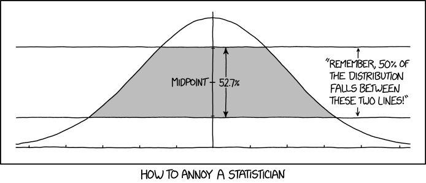

# Effect sizes and uncertainty {#chap6}


## Effect sizes
Null hypothesis significance testing (NHST), as covered in the previous chapter, emphasizes conclusions based on the presence vs. absence of an effect, according to a more-or-less arbitrary 'significance-level' defined by the _p_-value.^[As a brief aside, when thinking about the value of NHST, you should be aware that we are not limited to testing a null hypothesis of no effect, which is almost never likely to be true anyway. In fact, using classical (Frequentist), likelihood and Bayesian methods for example, we can compare the fit of models representing different competing hypotheses. You may wonder why we didn't just teach you this in the first place and it's a good question. First, as pointed out in the previous chapter ANOVA is a general statistical method whose use is not limited to NHST. Second, everything you are learning should provide you with a foundation on which to build. Third, you already know about maximum likelihood estimation methods, and you know how to compare models in R using likelihood ratio tests, for example. So it might not seem like it but you are well on your way.]

But it is just as - if not more important - to remember that the parameters you have estimated, and the relationship they describe, actually mean something. So rather than (or in addition to) hypothesis testing, you can use your parameter estimates, and estimates of uncertainty in your parameter estimates, to draw conclusions about how the world works. 

Let's model the association between height and weight using for the iKung San people again, and look at the estimates of the coefficients:

```{r eval=T, results='hide',include=T,echo=F}
d <- read.csv("iKung_HeightWeight.csv")
d2 <- d[d$age>=18,c(5,6)] # subset the dataframe to only include the height and weight variables of adults over the age of 18
d2 <- na.omit(d2) # remove the rows of the new dataframe that contain NAs.
```

```{r eval=T, results='show',include=T,echo=T}
m1 <- lm(formula = height ~ weight, data=d2)
coefficients(m1)
```

The coefficient 'weight' describes the strength of the relationship between 'weight' (our predictor variable) and height (our response variable). Because weight is measured in kg and height is measured in cm, we can say that height increases with weight at a rate of 0.905 cm of additional height for every 1kg of additional weight. So, you don't need to focus on _p_-values and tests of statistical significance. You can focus on _effect sizes_. Some argue that estimation of biologically-relevant parameters and (relatedly) effect sizes, and their biological (rather than statistical) significance are more important than hypothesis testing. Either way, estimation of effect sizes and hypothesis testing are not mutually exclusive and regardless of whether you 'do' hypothesis testing, you should always (also) focus on effect sizes. 


## Uncertainty

In many ways our 'point' estimates of the model coefficients (extracted using `coefficients(model)`) are our 'statistical best guesses'. But they are far from certain. In fact unless you are sampling the entire population (in which case you are not  'sampling') and measuring things perfectly then your point estimates ARE CERTAINLY WRONG. So we should not place too much weight on our parameter estimates without also quantifying our uncertainty in those estimates.

### Standard errors and confidence intervals

Formal expressions of uncertainty in our estimates are often expressed as confidence intervals around our estimates (at least for Frequentist [cf. Bayesian] methods). Confidence intervals are derived from the standard error of the estimate. What is a standard error, how does the standard error relate to a confidence interval, and how should a confidence interval be interpreted?

<center><iframe width="560" height="315" src="https://www.youtube.com/embed/LAujBMcUvZU" title="YouTube video player" frameborder="0" allow="accelerometer; autoplay; clipboard-write; encrypted-media; gyroscope; picture-in-picture" allowfullscreen></iframe></center>
\

<center>{width="85%"}</center>\


### A practical example 

We will (maybe) use some different examples in coming chapters! But for now, we are sticking with our exploration of the association between weight and height. Using this example, how do we calculate confidence (and prediction) intervals on parameters and on the fitted regression line in R? Once you know how to do this, you should be able to apply these methods more generally. 

The formula for a confidence interval for an estimate, where the sampling distribution of the estimate is described by a _t_-distribution is:

$\hat\beta\pm t_{1-\textrm{alpha}/2,\textrm{df}}\times\sigma_{\hat\beta}$

where alpha is equal to the 'significance' level, and df is equal to the residual degrees of freedome ($n-k$). To generate a 95% CI, alpha = 0.05. To generate a 71% CI, alpha = 0.29. But why don't we let R do the work: 

```{r eval=T, results='hide',include=T,echo=F}
d <- read.csv("iKung_HeightWeight.csv")
d2 <- d[d$age>=18,c(5,6)] # subset the dataframe to only include the height and weight variables of adults over the age of 18
d2 <- na.omit(d2) # remove the rows of the new dataframe that contain NAs.
```

```{r eval=T, results='show',include=T,echo=T}
m1 <- lm(formula = height ~ weight, data=d2)

alpha <- 0.05
m1$coef[2] - (qt(1-alpha/2,m1$df.residual)) * summary(m1)$coefficients[2,2] # lower
m1$coef[2] + (qt(1-alpha/2,m1$df.residual)) * summary(m1)$coefficients[2,2] # upper
```

<span style="color: red;">**Exercise**</span> Work through the syntax to calculate the upper and lower bounds of the CI above to 'decipher' each term. What is `qt()` and what are its arguments? Why do we use `qt()` (the mini-lecture should help here). How did I extract the standard error of the coefficient? 

Of course we can also use a convenient shortcut in R:

```{r eval=T, results='show',include=T,echo=T}
confint(m1)
```

You can see that our 'long-cut' and R's shortcut both give the same upper and lower bounds of the 95% CI. 

As shown in the mini-lecture, we can also generate confidence intervals around the regression line (rather than just on individual coefficients such as the intercept and slope). Confidence intervals around the regression line account for uncertainty in $\hat{y}$ for each $x_i$

To do this in R is straightforward. First create a dataframe of new 'weight' values for which we would like to predict height values based on the fitted model, and for which we would like to generate CIs:

```{r eval=T, results='show',include=T,echo=T}
newdat <- data.frame(weight=seq(min(d2$weight),max(d2$weight),length.out=400))
head(newdat)
```
\
Now use the `predict()` command to predict new values of height (according to the fitted model), and to generate confidence intervals, using the argument `interval ="c"`
```{r eval=T, results='show',include=T,echo=T}
predCI <- as.data.frame(predict(m1,newdata = newdat,interval = "c"))
head(predCI)
```
\
And finally, plot the results:
```{r eval=T, results='show',include=T,echo=T}
plot(height~weight,data = d2)
lines(predCI$fit~newdat$weight,lwd=2) # add fitted/predicted line
lines(predCI$lwr~newdat$weight,lty=3,col="red",lwd=2) # add line for lower bound on CI
lines(predCI$upr~newdat$weight,lty=3,col="red",lwd=2) # add line for upper bound on CI
```

Note that the confidence interval provides information on the precision of our estimate of the fitted line. Being able to predict brand new _observations_ of height in a new sample from the population is something different - a prediction interval, which gives the interval for which we have a certain level of confidence that, say, 95% of new observations from the population will fall within:

```{r eval=T, results='show',include=T,echo=T}
predPI <- as.data.frame(predict(m1,newdata = newdat,interval = "p"))
head(predPI)

plot(height~weight,data = d2)
lines(predCI$fit~newdat$weight,lwd=2) # add fitted/predicted line

# confidence intervals
lines(predCI$lwr~newdat$weight,lty=3,col="red",lwd=2) # add line for lower bound on CI
lines(predCI$upr~newdat$weight,lty=3,col="red",lwd=2) # add line for upper bound on CI

# prediction intervals
lines(predPI$lwr~newdat$weight,lty=3,col="blue",lwd=2) # add line for lower bound on CI
lines(predPI$upr~newdat$weight,lty=3,col="blue",lwd=2) # add line for upper bound on CI
```

\
How _confident_ are you now in your growing statistical skills?


