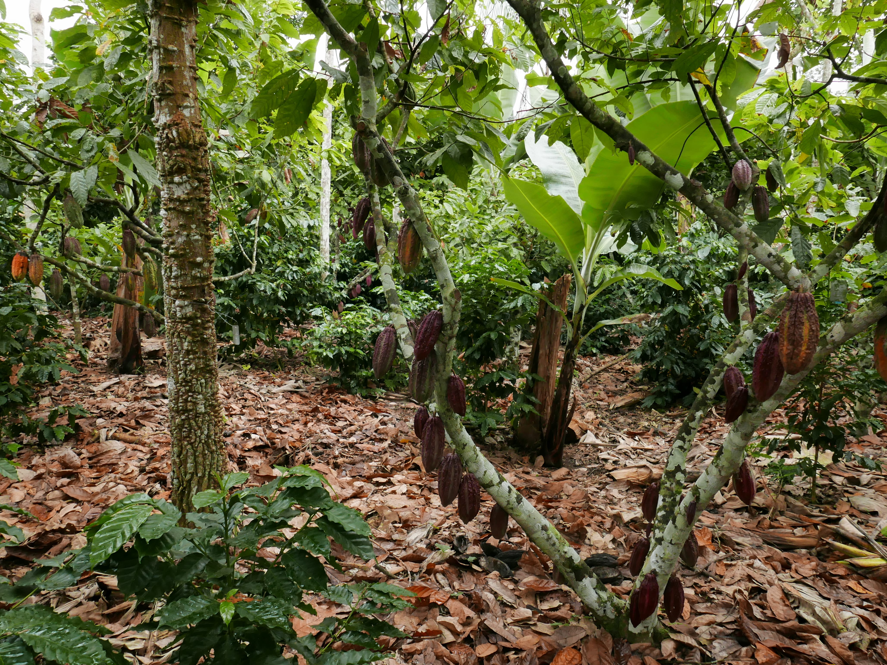

# A wicked biological problem {#chap7}

Now it really is your turn. You should have, by now, learnt quite a bit about simple linear regression (i.e. linear regression with one predictor variable), including how to explore the data, fit the model, check assumptions, resolve violations of assumptions, interpret model summaries, understand metrics of goodness of fit, formally quantify uncertainty, and visualise the data and results. I also hope that you have been following along by analysing the iKung San height and weight data as you've been working through this document. But now it is time to apply your understanding to a wicked biological problem.

## The biological problem
Feeding a growing global population while mitigating and adapting to climate change and conserving biodiversity will be one of the most important interconnected biological problems to solve this century. Intensive agriculture can produce a lot of food, but often contributes strongly to ongoing climate change, is itself vulnerable to climate change, and is often implemented in ways that threaten biodiversity. 

Agroforestry – the deliberate inclusion of ‘shade-trees’ in cropping systems – is often advocated as an alternative to intensive agriculture. Wanna know where a lot of your chocolate comes from? Check out this cocoa agroforest in West Africa, where 65% of the world's cocoa is grown:

{width=90%}

\
\
Advocates for agroforests insist that agroforestry will mitigate climate change (by storing more carbon), assist with adaptation to climate change (by reducing temperatures experienced by crops), improve soil fertility and therefore agricultural yield (by increasing soil nitrogen and phosphorous, for example), and increase biodiversity (by providing habitat). However, critics of agroforests note that yields of crops under shade trees will be lower because of competition between shade trees and the primary crop (for light, water, and nutrients), leading to less food per unit area, and thus requiring more land for the same amount of food production (and therefore, more deforestation).

The potential benefits of agroforestry:

{width=90%}

## Can you solve this problem?
You have the data to test each of these ideas: [Cocoa Agroforestry Data from Ghana](https://drive.google.com/file/d/1nQ-q8El9DjzCY6oYNinxHxYuvWmIW83h/view?usp=sharing){target="_blank"}. And yes - this is real data, and some of the most comprehensive data ever to be collected on this multi-faceted biological problem (the data I have provided is only a subset of the full dataset).

The big questions are how does the cover of shade trees (our predictor variable) affect: a) cocoa yield, b) soil fertility (nitrogen, phosphorous, and soil moisture), c) losses of cocoa yield to disease, d) climate-change adaptation (by reducing daily maximum temperatures experienced by the crop under the shade-tree canopy), e) climate-change mitigation (by sequestering carbon in aboveground storage [i.e. as wood]), and f) biodiversity (in this case, bird species richness). 

All the response variables in the data frame are recorded as the percentage difference from a paired monoculture plot. So, for a given level of shade-tree cover, if the yield is shown as 633, then this is a 633% improvement over an agricultural monoculture. If the value of yield is -13, then this represents 13% less yield in an agroforestry plot compared with a monoculture. Make sense?

Your **Exercise** is to analyse the data using simple linear regression. You will need to fit a separate model for each reponse variable. You should use your growing understanding of the modeling process for each model: 

1. identify your response and predictor variables. 
2. explore your data (graphically is a good place to start). 
3. define a probability distribution that is, at least to a first approximation, likely to describe variation in your response variable (go with a normal distribution for now).
4. mathematically describe a potential relationship between predictor and response. For each model, write this out so you can fully absorb what you are doing when you shift to fitting the model in R. 
5. fit the model in R.
6. plot the model over the fitted observations. To a first approximation, does the model seem like a reasonable description of the data?
7. check model assumptions.
8. if assumptions are violated, do what you need to do to resolve any issues (e.g. refit the model after transforming the data, include extra terms to account for curvature, etc.). Repeat steps 4 to 8 until you are happy that you have 'found' a good model to describe your data. 
9. test hypotheses (assume a null hypothesis of no effect)
10. provide estimates of uncertainty (calculate confidence intervals on the parameters and on the regression line).   
11. plot the data together with the fitted model and confidence intervals. 
12. determine how much variation in your data the model explains.
\
\

Some questions to answer:

1. which (if any) response variables benefit from being transformed to meet model assumptions?
2. which (if any) response variables benefit from the addition of extra terms to describe curvature in the relationship? Can you use ANOVA, comparing nested models to determine if you should keep the polynomial terms?
3. the variation in which response variable is best explained by shade-tree cover? The variation in which response variable is the least well explained by shade-tree cover? (use metrics of goodness of fit).
4. which response variable is least likely to be 'affected by' shade-tree cover? (use hypothesis tests)
\
\

And finally: after completing the full set of analyses, what do you conclude about the effectiveness of agroforests for solving one of the thorniest sets of issues of the 21st century? 

