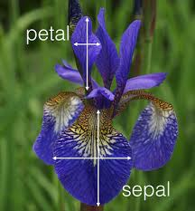

# LinearModels {#chap7}

Consider R. A. Fisher's classic Iris data set, consisting of several morphological measurements on the flowers of three species of _Iris_. This data set is famous in statistics and is often used as test data for a wide variety of statistical methods. Fisher was probably the most important statistician __and__ evolutionary biologist of the 20th century. He layed the foundations for our modern practice of statistics and he was a great evolutionary geneticist, partly responsible for inventing population genetics and establishing that natural selection could indeed be a powerful force in evolution. He was also a terrible grump and had lots of fights with other scientists. Although I like to find out about my idols, Fisher is someone that I am glad not to have met! Back to the data:
```{r, fig.cap="An Iris"}

```
```{r, fig.cap="R. A. Fisher"}
knitr::include_graphics("fisher-smiling-50.jpg")
```
```{r}
data(iris)
head(iris)
tail(iris)
```
Here we have loaded the data frame called ``iris`` It is built into R, which is convenient for us. The ``head()`` and ``tail()`` functions examine the first 6 and the last 6 lines of the data frame, allowing us to see the variable names and check that the data frame is usable. Although 
```{r, fig.cap="Iris setosa"}
knitr::include_graphics("Kosaciec_szczecinkowaty_Iris_setosa.jpg")
```

```{r, fig.cap="Iris virginica"}
knitr::include_graphics("220px-Iris_virginica.jpg")
```

```{r, fig.cap="Iris versicolor"}
knitr::include_graphics("220px-Iris_versicolor_3.jpg")
```
```{r}
summary(iris)
```
Here we have a six-figure summary of each of the variables: the mean, minimum and maximum values, plus the median, and first and 3rd quartiles. Together these numbers tell us a little about the distribution of the data (but not much).

## Graphing the Iris data

```{r, fig.height=2.5, fig.width=3.75}
library(ggplot2)
ggplot(aes(x = Species, y = Petal.Length), data = iris) +
geom_point() + ylim(0, 8)
```
Here we have a plot of the Petal Length for each species. The dots overlap a lot and it is hard to see what is going on, although you can see the maxima and minima quite clearly for each species.
```{r, fig.height=2.5, fig.width=3.75}
ggplot(aes(x = Species, y = Petal.Length), data = iris) +
geom_jitter(width = 0.4, height = 0) + ylim(0, 8)
```
Here are the same data but we have "jittered" the data along the x-axis, allowing us to see each data point separately from the others. This is a good way to display small amounts of data. Note that you should only jitter the data in the x direction in this case. Jittering the y data is wrong! (why?)
```{r, fig.height=2.5, fig.width=3.75}
ggplot(aes(x = Species, y = Petal.Length), data = iris) +
geom_boxplot() + ylim(0, 8)
```

If we have a larger amount of data, a box and whisker plot can be useful. It plots the median and interquartile range, and the outer ``whiskers`` extend to 1.5 x the size of the interquartile range. Extreme outliers are also indicated.

## Good Resources for Graphing

We won't have much time to go into advanced graphing techniques in this course, although I will try to highlight graphing methods as we go along. Fortunately, there are some good books to consult. They are online through the library:
 
- _R Graphics Cookbook_ by Chang
- _ggplot2 Elegant Graphics for Data Analysis_ by Wickham

## Analysing the iris data

How would you analyse these data? Since we have 3 distinct groups (species) to compare and the data are continuous and (probably) normally-distributed, the Analysis of Variance (ANOVA) might be your first choice. Here is an analysis for petal length in R:

```{r}
fit <- aov(Petal.Length ~ Species, data = iris)
summary(fit)
```

We see that there is evidence for significant variation in petal length among species. We reject the null hypothesis that there are no differences in petal length among the three species. Note that this is a very vague conclusion. We don't know which species differ in their petal length from the others, and we don't know how big the differences really are. A thorough analysis would establish this information.

## Model Diagnostics

When building a statistical model, checking the model using diagnostic plots is a crucial step. All models have assumptions and if these assumptions are violated then the model will potentially give wrong results. For the ANOVA model, there are several important assumptions:

- The data are independent
- The residuals follow a Normal distribution
- The variance of the residuals is constant over the range of the data (homoscedastic errors).

While all three assumptions are important, the first and third are crucial. It turns out that the Normality of residuals is not an overly strong assumption for the ANOVA model, but you should still check it, as large departures from Normality can cause problems. I usually rely on graphical approaches to testing assumptions:

```{r, fig.height=4, fig.width=8}
par(mfrow=c(1,2))
plot(fit, which = 1:2)
```

The first diagnostic plot above, plots the residuals versus their fitted values. If the assumption of homoscedasticity holds (try saying that 5 times fast!), there will be no pattern to the residuals. If you see a curve, either upwards or downwards, that is suggestive of curvature in your data. If there is a "trumpet" like effect either increasing to the right or left, or you have a "bow tie" shape to the residual plot ie narrower in the middle, then the data are not homoscedastic.


Subset and Recode the Data}
```{r}
iris2 <- subset(iris, Species != "setosa")
```

Hypothesis: There exists a difference between the species' means. How would you analyse these data?
- t-test?
- ANOVA?
- Regression?
- All three!!!

## Analysis using t test 
```{r}
fit.ttest <- t.test(Petal.Length ~ Species, 
  data = iris2, var.equal = TRUE)
print(fit.ttest)
```

## Analysis using ANOVA
```{r}
fit.anova <- aov(Petal.Length ~ Species, data = iris2)
summary(fit.anova)
```

## Analysis using Regression
```{r}
fit.regression <- lm(Petal.Length ~ Species, data=iris2)
summary(fit.regression)
```

## Points to Note
- For an F test with __one__ degree of freedom in the numerator, $F = t^2$ with the denominator degrees of freedom for the F statistic equal to the degrees of freedom for the t statistic.
\item We can get the regression output from the ANOVA fit using ``summary.lm``

```{r}
summary.lm(fit.anova)
```

Regression Plot

```{r, fig.height=3.2, fig.width=5}
iris2$coded <- ifelse(iris2$Species == "versicolor", 0, 1)
options(warn = -1)
mns <- tapply(iris2$Petal.Length, iris2$coded, mean)
df <- data.frame(Petal.Length = mns, coded = 0:1, lower=c(NA, mns[1]), upper = c(NA, mns[2]))
ggplot(data=iris2, aes(coded, Petal.Length)) + 
geom_point() + 
geom_smooth(method = lm , color = "red", se = FALSE, formula=y~x) +
geom_errorbar(data = df, mapping = aes(x = coded, ymin = lower, 
  ymax = upper), width = 0.05, col = "blue") + ylim(2.5, 7.5) + xlim(0, 1) +
geom_text(label = paste(expression(beta[1])), x = 0.5, y = 4.5, parse = TRUE) +
geom_text(label = paste(expression(beta[1])), x = 0.95, y = 5, parse = TRUE) +
geom_text(label = paste(expression(beta[0])), x = 0.05, y = 4, parse = TRUE) +
geom_text(label = paste(expression(height == beta[0] + beta[1] %*% Species)), 
  x = 0.5, y = 7, parse = TRUE)
```

## Summary
- If we code our categorical variables as 0, 1, then the slope $\beta_1$ is the same as the difference between the means for each category.
- The intercept $\beta_0$ is the value for the baseline category.
- With 3 or more categories, we construct the 0, 1 ``dummy variables``:

```{r}
cat.var <- LETTERS[1:3]
model.matrix(~cat.var)
```

## Linear Models
- Comparing groups or doing regression are \textbf{both} examples of the General Linear Model.
- Regression: $y_i = \beta_0 + \beta_1x_i + \epsilon_i, \epsilon \sim NID(0, \sigma^2)$
- ANOVA: $y_{ij} = \mu + \tau_i + \epsilon_{ij}, \epsilon \sim NID(0, \sigma^2)$ 
- Why ``Linear?'' Definition: A linear transformation (equation) is defined by these 2 properties:

-- $f(x + y) = f(x) + f(y)$: Additivity
-- $f(Ax) = Af(x)$ : Homogeneity
-- Idea: The whole is equal to the sum of its parts

Linear models are the workhorse of all statistical modelling. They crop up everywhere. Especially, the computational ease with which we can analyse linear models governs the procedures for the design of experiments. The reason for the use of the guidelines for the design of experiments in Chapter 6 is precisely so that we can apply a linear modelling framework to the experimental system. This is why we need to spend so much time on them. An appreciation of the mathematics is very useful for understanding their uses, similarities and differences from each other.

## Matrix Notation for Linear Models

The mathematical formulation of a linear regression model (perhaps the simplest linear model) is below:

$Y_i= \beta_0 + \beta_1 X_i + \epsilon_i, \epsilon_i \sim NID(0, \sigma^2)$

The $Y_i$'s are the values of the response variable. The $\beta$'s are the intercept and slope parameters. It is these that we would like to estimate.. $X_i$ are the data for the explanatory variable.  $\sigma^2$ is the error variance: the variance of the residuals around the line. The residual is simply the distance between the data point and the fitted line, on the y axis. We can write down an equation for each data point:

$$
Y_1 = \beta_0 + \beta_1 X_1 + \epsilon_1 \\
Y_2 = \beta_0 + \beta_1 X_2 + \epsilon_2 \\
Y_3 = \beta_0 + \beta_1 X_3 + \epsilon_3 \\
\vdots \qquad \vdots \qquad \vdots \\
Y_n = \beta_0 + \beta_1 X_n + \epsilon_n 
$$

We can form column vectors for the elements of each equation:

$$
\begin{bmatrix} Y_1 \\ Y_2 \\ Y_3 \\ \vdots \\ Y_n \end{bmatrix} = 
\begin{bmatrix} \beta_0 + \beta_1X_1 \\
                \beta_0 + \beta_1X_2 \\
               	\beta_0 + \beta_1X_3 \\
               	\vdots \\
               	\beta_0 + \beta_1X_n
\end{bmatrix} +
\begin{bmatrix} \epsilon_1 \\ \epsilon_2 \\ \epsilon_3 \\ \vdots \\ \epsilon_n \end{bmatrix}
$$

## Matrix Representation

We can then factor out the $\beta$ terms from the middle vector.

$$
\begin{bmatrix} Y_1 \\ Y_2 \\ Y_3 \\ \vdots \\ Y_n \end{bmatrix} = 
\begin{bmatrix} 1 & X_1 \\ 1 & X_2 \\ 1 & X_3 \\ \vdots & \vdots \\ 1 & X_n \end{bmatrix} \times
\begin{bmatrix} \beta_0 \\ \beta_1 \end{bmatrix} +
\begin{bmatrix} \epsilon_1 \\ \epsilon_2 \\ \epsilon_3 \\ \vdots \\ \epsilon_n \end{bmatrix}
$$
We can then write down the matrix equation for the linear model:

$$
\mathbf{Y}= \mathbf{X}\mathbf{\beta}+\mathbf{\epsilon}
$$
$$
\mathbf{X}= \begin{bmatrix} 
	1 & X_1 \\
	1 & X_2 \\
	1 & X_3 \\
	\vdots & \vdots \\
	1 & X_n \end{bmatrix} \mathbf{\beta} = \begin{bmatrix} \beta_0 \\ \beta_1 \end{bmatrix} \mathbf{\epsilon} = \begin{bmatrix}
\epsilon_1 \\ \epsilon_2 \\ \epsilon_3 \\ \vdots \\ \epsilon_n \end{bmatrix} \mathbf{Y} = \begin{bmatrix}
Y_1 \\ Y_2 \\ Y_3 \\ \vdots \\ Y_n \end{bmatrix}
$$
Here we have $\mathbf{X}$ which is called the __design matrix__. $\beta$ is the __vector of parameters__ (to be estimated). $\mathbf{\epsilon}$ is the __vector of errors__. $\mathbf{Y}$ is the __vector of responses__. In this, the General Linear Model, $\mathbf{X}$ can have more than 2 columns. The first column is usually a vector of 1's (corresponding to the intercept). The other columns contain the explanatory variables, which may be continuous (leading to __multiple regression__) or discrete (usually 0, 1), leading to the __Analysis of Variance__ (ANOVA). Mixtures of continuous and discrete explanatory variables lead to the __Analysis of Covariance__ (ANCOVA) and other more complicated models. 

## Distributional Assumptions

Finally, we have to specify the assumptions regarding the statistical distribution of the residuals. This will usually be one number, specifying that the variance of residuals, given the symbol $\sigma^2$. If we want to specify the variance for each data value, we can write:

$$
\sigma^2_\epsilon = \sigma^2\mathbf{I} = \begin{bmatrix}
\sigma^2 & 0 & \cdots & 0 \\
0 & \sigma^2 & \cdots & 0 \\
\vdots & \vdots & \ddots & \vdots \\
0 & 0 & \cdots & \sigma^2
\end{bmatrix}
$$
where $\mathbf{I}$ is the identity matrix. Thus, each data point has a variance of $\sigma^2$ and the off-diagonals are all zero, signifying that there is __no correlation__ between the data points. We can write this as:
$$
\epsilon \sim N(0, \sigma^2\mathbf{I})
$$
We say that the epsilons ($\mathbf{\epsilon}$) are __distributed as__ following a Normal distribution, with zero mean and variance $\sigma^2\mathbf{I}$. __N__ is the usual symbol for the Normal distribution and the "~" means "is distributed as."

This leads to the Full model:

$\Huge\textbf{Y} = \mathbf{X\beta} + \mathbf{\epsilon}, \quad \mathbf{\epsilon} \sim N(0, \sigma^2\mathbf{I})$

__This equation is worth remembering.__

## Estimation: Ordinary Least Squares

We wish to estimate $\beta$ and $\sigma^2$. This is usually done by the method of Ordinary Least Squares (OLS). The derivation of these estimators is beyond the scope of the course. You may have seen the formula for $\hat{\beta}$ before: it was the last exercise in the matrix problem sheet.
$$
\hat{\beta} = (\mathbf{X^TX})^{-1}\mathbf{X^T} \mathbf{Y} \\
\hat{\sigma^2} = \frac{1}{n - p}(\mathbf{Y} - \mathbf{X\hat{\beta}})^T (\mathbf{Y} - \mathbf{X\hat{\beta}})
$$
where $\hat{\sigma}^2$ is the unbiased estimator of $\sigma^2$, and $p=2$ in the situation where we are estimating the slope and the intercept. $n$ is the sample size.
