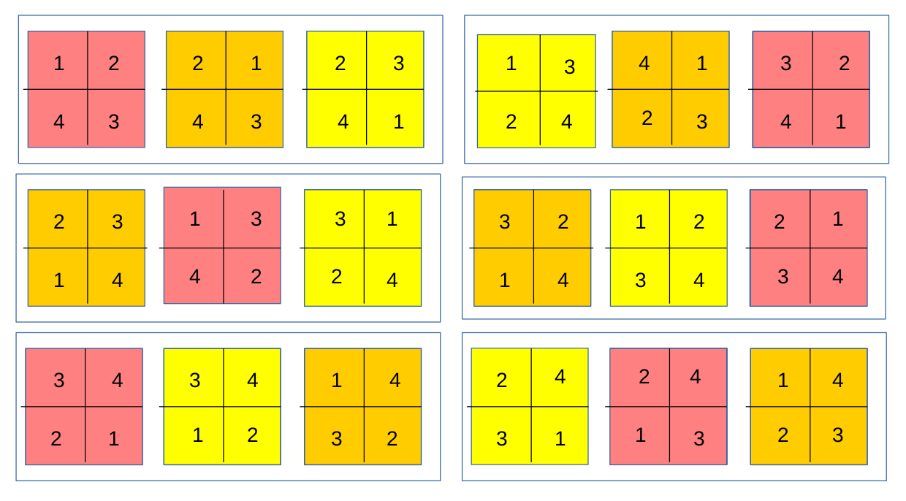

# Mixed Effects Models {#chap10}

## Model Formulae

Recall that the general linear model (LM) can be written as:
$$
\mathbf{Y}=\mathbf{X}\beta + \epsilon, \epsilon \sim N(0, \sigma^2\mathbf{I})
$$
This can also be written as:
$$
E(\mathbf{Y}) = \mathbf{\mu} = \mathbf{X}\beta, \mathbf{Y} \sim N(\mathbf{\mu}, \sigma^2\mathbf{I})
$$
leading to the Generalised Linear Model (GLM):
$$
g(\mathbf{\mu}) = \mathbf{X\beta},\; \mathbf{\mu} \sim f(\mathbf{\mu, \theta})
$$
The main innovations of the Generalised Linear Model are that firstly, it can handle different distributions for the response variable other than the Normal distribution. Secondly, it has the concept of a __link__ function that allows the modelling of the linear effects of $X\beta$ (the __linear predictor__) onto a transformed scale, hence allowing for some nonlinear properties of the data. For example, the $logit()$ link function for the Binomial distribution, which we have seen previously.

In this chapter, we extend the general linear model in another direction, with the incorporation of __random effects__. Our new model will be:

$$\mathbf{Y} = \mathbf{X\beta} + \mathbf{Zb} + \mathbf{\epsilon}, \epsilon \sim N(0, \sigma^2\mathbf{\Sigma}), \mathbf{b} \sim N(0, \delta^2\mathbf{G})$$
We can see that this new model is very similar to the general linear model, but with a couple of additions. There is still a response variable ($\mathbf{Y}$), a linear predictor ($\mathbf{X\beta}$), and a distributional assumption about $\epsilon$. However we have a new thing that looks like a linear predictor, $\mathbf{Zb}$. We also have a distributional assumption for $\mathbf{b}$. We call $\mathbf{b}$ the __random effects__ and $\mathbf{Z}$ is the __design matrix__ for the random effects. Like the $\epsilon$ terms, the random effects are assumed to be Normal, with zero mean and some variance $\delta^2$ and covariance matrix $\mathbf{G}$. $\mathbf{G}$ will often be the identity matrix ($\mathbf{I}$), but not necessarily so, similar to what we saw when we briefly looked at models for correlated data (in Chapter 8). The so-called __fixed effects__ are modelled using the fixed effects design matrix ($\mathbf{X}$), as previously in the general linear model. We are interested in estimating the Greek letters again: the fixed effects ($\mathbf{\beta}$), the residual variance ($\sigma^2$) and the variance of the random effects $\mathbf{\delta^2}$. In fact, there may be many extra variances to estimate from the random effects, depending on the complexity of $\mathbf{Z}$.

## Definition of Random Effects

Random effects are very slippery beasts. They can be difficult to understand and define. Here are some definitions, (from Gelman, A. Analysis of variance - Why it is more important than ever. Annals of Statistics 33(1):1-31):

1.  Fixed effects are constant across individuals, and random effects vary. For example, in a growth study, a model with random intercepts $\alpha_i$ and fixed slope $\beta$ corresponds to parallel lines for different individuals $i$, or the model $y_{it}=\alpha_i+\beta_t$. (Kreft and de Leeuw 1998)

2.  Effects are fixed if they are interesting in themselves or random if there is interest in the underlying population. (Searle et al. 1992)

3.  When a sample exhausts the population, the corresponding variable is \emph{fixed}; when the sample is a small (i.e., negligible) part of the population the corresponding variable is \emph{random}. (Green and Tukey 1960)

4.  If an effect is assumed to be a realized value of a random variable, it is called a random effect'' (LaMotte 1983)

5.  Fixed effects are estimated using least squares (or, more generally, maximum likelihood) and random effects are estimated with shrinkage [*linear unbiased prediction*]. (Robinson 1991)

You can see that these definitions are not very exact, and they differ in the emphasis they place on various properties of random effects and their estimation. If you have trouble understanding what random effects are, you are in good company!

## Example 1: Repeated Measures

A researcher wishes to study the factors affecting the population density of black rock skinks (*Egernia saxatilis*) in ten different
sites. At each site, she records the population density of skinks at twenty rock outcrops (in lizards $m^{-2}$ ). In addition, she records the area of the outcrop, the diameter of the largest rock in the outcrop and the aspect (in degrees from North).


Here, the response variable is the density of skinks. The explanatory variables are site, area, diameter and aspect. Of these, site is a random effect (ie part of $\mathbf{Z}$). The others are (fixed) covariates (ie. part of $\mathbf{X}$). Site can be considered random as it is a sample of sites the researcher _could_ have sampled. Definitions 2 and 3 above seem to apply. Each site is measured several times (several outcrops), so this sampling scheme can be considered a __repeated measures__ design, another name for mixed-effects models. (You may have noticed that the researcher counted skinks, so technically the response is a _count_ variable, and a Generalised Linear Model might be more appropriate. In fact, this leads to the technique of Generalised Linear Mixed-Effects Models (GLMM), which is beyond the scope of this course. You should research GLMMs yourself!)

## Example 2: The Split-Plot Design.

A researcher sows a crop of three cereal grains, each in 6 separate blocks. Within each plot, subplots are created and each subplot is fertilised with one of four different fertiliser concentrations. The crop yield is measured on each subplot.


Here we see that there are 6 blocks, with 3 plots each. Each plot is a different colour, within a block, representing the variety of oats that have been sown. The plots are further divided into 4 subplots. Four different fertilizer treatments were applied to each of the four subplots in each plot, represented by the numbers. We can see that both the blocks and the plots are measured more than once (that's repeated measures, again.). There are really two experiments going on here: One to look at which variety produces the most yield (at the plot level) and one which determines the effect of each fertilizer on yield (at the subplot level). This __nested__ structure for the experiment is a classic case of random effects. We have plots nested within blocks and subplots nested within plots. As a rule, nested effects are always random. We can analyse this data in R as it is part of the ``nlme`` package, which contains functions for mixed-effects models.

```{r}
library(nlme)
data(Oats)
summary(Oats)
head(Oats)
```
We can now fit the mixed-effects model:

```{r}
Oats$nitro <- factor(Oats$nitro)
fit <- lme(yield ~ Variety * nitro, random=~1|Block/Variety, data = Oats)
anova(fit)
```

What's going on here? Well, we use the ``lme`` function to fit the model. "lme" for linear mixed-effects, similar to ``lm`` and ``glm``. It has a familiar syntax. The first argument is a formula. Here, we model yield as a function of Variety (of oats) and nitro (fertilizer treatment). The ``*`` signifies that we also want to look at the __interaction__ of Variety with nitro. This is because there may be __non additive__ effects, for example a particular Oat variety may perform far better (or far worse!) on one particular fertilizer concentration compared to another. Interaction effects are common in biology so it is usual for us to at least allow the possibility that they occur in this case. The next argument is the keyword ``random`` and it is a one-sided formula (see the ``~`` sign), followed by a 1, and a vertical bar (|) and then Block/Variety. In the lme function, this is the way nested random effects are specified. We say that Variety is nested with Block. The ``1`` specifies that the random effect is on the __intercept__. In effect, if this were a regression problem, this would amount to allowing a different intercept for every Variety within every Block.

Next we simply produce the fixed-effects ANOVA table and we can see that ther is no significant interaction term (Variety and nitro show no significant non-additive effects), and no effect of Variety, but there is a significant effect of fertilizer concentration on yield. Notice that Variety appears in the fixed effects formula _and_ the random effects formula. This is unusual. Mostly the fixed and random effects should be separate (see the equation above, which puts them in different design matrices). However in the case of the split-plot design, the variable Variety is really just a place holder for the number of the plot within each Block, so we can use the Block variable in two places in the call to ``lme``.

Finally, we can look at the summary output of the model to examine the estimated effect sizes for each $\beta$ parameter in the model, and each variance parameter. (There will be 3 variance parameters: one for the among-Block variance, one for the among-Plot variance, and one for the error variance ($\sigma^2$).)

```{r}
summary(fit)
```
First we see some basic details about the model fit, such as the Akaike Information Criterion (AIC), the Bayesian Information Criterion (BIC) and the value of the loglikelihood at its maximum. These values can be used to compare different models. The next section in the summary output shows the random effects. They are presented as Standard Deviations (which are just square-roots of the variances). As predicted, there are 3 values. The first is for the Block effect (which we label as $\delta_1$), the second for the Variety within Block effect ($\delta_2$) and the Residual error standard deviation ($\sigma$). We can see that both the Block and Variety standard deviations are quite high and comparable to the error standard deviation, suggesting that these effects are important in our model. The next part of the output is the fixed effects. Here we get the $\beta$ terms for our fixed effects model. There are a lot of them. The (Intercept) value is the estimated yield when the Variety is at its baseline category (Golden Rain variety in this case) and at zero nitrogen treatment. The other $\beta$ parameters are the _differences_ between the stated effects and the Intercept value. It's hard to interpret this output because of the interaction terms, but note that they all have p > 0.05, which agrees with the ANOVA table output. Also, we can see that the effect of nitro fertilizer concentration is different from zero for all 3 fertilizer treatments (remember, the 4th is the control and is part of the intercept in this analysis). The effects of Variety Marvellous and Victory are not significantly different from the Intercept, which refers to Golden Rain.

The next part of the output is the correlations among the fixed effects. This part of the output is not usually of much interest, except when the matrix (in the form of a covariance matrix) is used, for example, in the Delta method such as we used in the GLM practical class. The next part of the output is just a 5 number summary of the residuals. From this, we can get an idea of the skewness of the residuals. Ideally we want the quartiles roughly centered around the median. Finally, there is information on the sample size for the experiment: 72 observations in 6 blocks, with 18 replicates of Variety nested within Block.

Finally, we should look at some diagnostic plots to determine the appropriateness of our model:

```{r}
plot(fit); qqnorm(fit, abline=c(0,1))
```
We can see that there is good scatter along the fitted values, with no obvious trend or change in variance (trumpet or bow-tie effects). The Normal QQ plot is also quite good. The $\epsilon$'s are mainly on the line, with some slight evidence of right-skew. We can see this because the dots on the left-hand side of the plot fall below the line, showing that the tail is "thinner" than for a Normal distribution, and the dots on the right-hand side of the plot fall above the line, showing that the upper tail is "fatter" than for a Normal distribution. Some skew is very common in these sorts of statistical models, mostly because (by definition) the tails of the distribution are hard to sample.

We can get some idea about what is going on by looking at a histogram of the residuals:

```{r}
library(ggplot2)
dat <- data.frame(residuals = resid(fit))
ggplot(aes(x=residuals, y = after_stat(density)), data=dat) +
geom_histogram(bins=15, fill="white", colour="black") +
geom_density()
```
We can see that there is a slight hint of bimodality, but this is not worth worrying about and didn't really jump out at us from the QQ plot. We can see that there are more data on the far right-hand side than on the far left, showing the skew to the right.