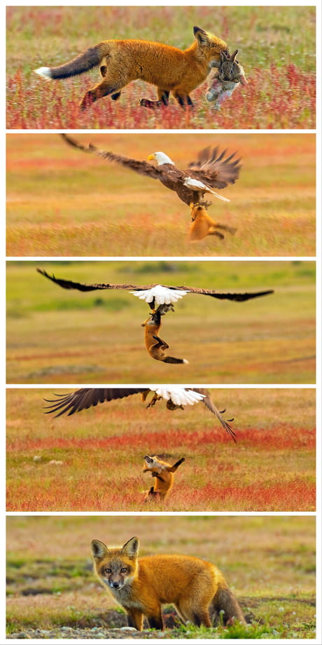

# Practical Week 5: Binomial regression in two ways {#chap16}

{width=100%}

_The Asian tiger mosquito_ Aedes albopictus _pollinating a flower and getting a feed. This species is an important vector for the transmission of several nasty diseases including dengue fever_

## Problem 1: What environmental variables are most strongly associated with the occurrence of dengue fever?

Mosquitoes need more than blood. In fact, many (all?) species of mosquitoes feed on nectar, which can be an important source of carbohydrates necessary for mosquito reproduction and survival. And this all means two things: 1) mosquitoes are important pollinators (good), and their nectar feeding habits probably influence their ability to transmit disease (not so good). What a rich area of [study](https://www.pnas.org/doi/10.1073/pnas.1910589117){target="_blank"} this could be. 

We're not going to look at this interesting interaction this week and we're not really even looking at mosquitos. But we are going to explore potential determinants of the _occurrence_ of a mosquito borne disease - [dengue fever](https://www.who.int/news-room/fact-sheets/detail/dengue-and-severe-dengue){target="_blank"}. And as you now know, when modeling (binary) nominal response variables such as occurrence (i.e. presence vs. absence), we need to model our (nonlinear) using a 'generalized linear model' with a binomial likelihood.

This week's data comes from important early research published in the prestigious medical journal [_The Lancet_](https://www.thelancet.com/article/S0140-6736(02)09964-6/fulltext){target="_blank"}. The goal of this research was to identify the environmental determinants of the occurrence of dengue. The original analysis used the parameter estimates from the model to make predictions about the future distribution dengue under climate change.

Choose two environmental predictor variables from the [data](https://drive.google.com/file/d/1s79Lw3iekDo0RwaQ7_WGY2_jpBhr0ysy/view?usp=sharing){target="_blank"} and explore their influence on the occurrence of dengue using logistic regression. Step through the modeling process (scientific question, data exploration, fit, check, re-fit, check, hypothesis test, visualization and description of results). What do your results tell you about the environmental variables associated with dengue occurrence?

## Problem 2: Binomial regression on pirates

Eagles make great pirates - they are known to steal prey items not only from other species (see below), but also from each other. 

{width=100%}

_A bald eagle stealing a rabbit from a fox._ 

Your task is to determine what traits of pirates, and what traits of the birds that are the victims of the pirates determine a successful 'steal'. But there is a small catch. I have provided exactly the same data in two different ways: [one way](https://drive.google.com/file/d/1D7SsOSfjYvq3eoe1p03M0REaRGw1a_Gm/view?usp=sharing){target="_blank"} and [another way](https://drive.google.com/file/d/1lfng16zdDdNddaVwGU5EPcdTGWQ7VV0b/view?usp=sharing){target="_blank"}. Your first task is to see if you can understand the relationship between the two sets of data - how exactly are they the same but presented in different ways? Your second task is to analyze both sets of data using GLMs. Begin with the dataframe "Eagle.csv", and fit a model including all predictor variables and their interactions. What happens? Solve this problem and then fit GLMs to both sets of data to see how the results compare. Can you interpret the model coefficients on the link scale?     

