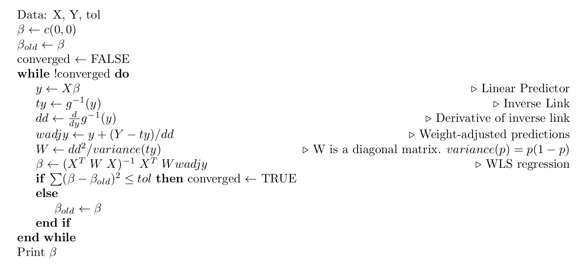

# GLM exercises {#chap18}

## Iteratively Reweighted Least Squares
The following is a pseudocode version of the algorithm for Iteratively Reweighted Least Squares (IRLS). This is the most common algorithm used to fit GLMs. Your task is to write this pseudocode into R and test it by comparing your results to the $\texttt{GLM}$ function in R. As a test dataset, use the rats dataset [here](./rats2.csv). ie:

```{r}
dat <- read.csv("rats2.csv")
head(dat)
```
This data set consists of groups of rats which were exposed to different levels of radiation, and whether the rat died or lived. Plot the data. What sort of analysis is appropriate? Here is the pseudocode:



## Goodness of Link Test

Last week we talked about which link function to use for a binomial logistic regression. There are several available in R. (see: $\texttt{?family}$). One approach to choosing a link function is to use the Pregibon test (Pregibon 1980). Install the LDdiag package for R. It is not available on CRAN but it is in the Archive. Do:

```{r, eval=FALSE}
devtools::install_version("LDdiag","0.1") ## Only need to do this once.
```

Use the Pregibon test as implemented in LDdiag to perform a goodness of link test for binomial models of the rats data. Plot the data and the fitted curves. Which link function is best? Why? Use the data set [rats.csv](./rats.csv):

```{r}
dat <- read.csv("rats.csv")
head(dat)
```
This is just the same data as in rats2.csv, except grouped according to the radiation dose.

## References
 Pregibon, D. (1980). Goodness of Link Tests for Generalized Linear Models. _Applied Statistics_. **29:** 15-24.
