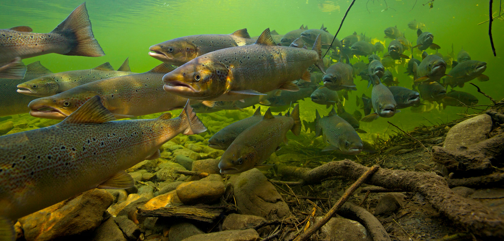
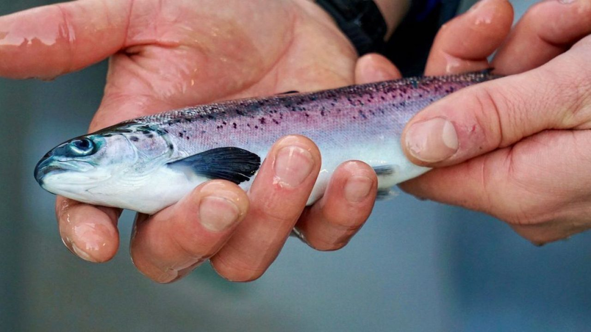

# Assignment 2: The Old Man and the Sea {#chap19}

## A big biological problem

{width=100%}

_Reproduced from: López-Otín, C., M. A. Blasco, L. Partridge, M. Serrano, and G. Kroemer. 2013. The Hallmarks of Aging. Cell 153:1194-1217._

Understanding how, why, and when the process of aging occurs (and how to slow its course) is a really fundamental and quite hot topic in biology. Aging is caused by and causes all sorts of deterioration in physiological function and, of course, ultimately leads to death.^[Is this course getting depressing? We started by analysing data related to sleep, and since then we've covered climate change, war, and now we're on to death. That's at least three horses of the apocalypse, right?] Over the last couple of decades several correlates - or 'hallmarks' of aging have been identified (see Figure above), and much work is being done to understand the relationships between these different candidate hallmarks, and their relative contribution to aging. 

One consistent correlate of a decline in physiological status in general, and aging in particular appears to be the attrition - or shortening - of the ends of our chromosomes, which are known as telomeres. Telomeres are made up of repetitive nucleotide sequences at the end of chromosomes and are believed to protect the 'more important' parts of chromosomal DNA from degradation during repeated bouts of cell division. But, as we age, telomeres get shorter and shorter and so are less able to fulfill that function. Moreover, telomeres can also be damaged by environmental stressors as the high guanine content of telomeres makes them particularly susceptible to oxidative stress. 
\

{width=100%}

\
So, perhaps people born in highly favorable environments with long telomeres live longer...
\

## A more specific problem
But what has this got to do with the sea? Well, of course, it's not just humans that have to worry about their health and premature aging. Animals and plants often deal with arduous life history 'requirements' before they are able to successfully reproduce. 

\

{width=100%}

\

Salmon, for example, are well known for their heroic movements from freshwater rivers to the sea and back again. And only once they are back again are they able to reproduce, after which they are so exhausted that the famously die pretty much en masse. So among all the other things that have to go their way during these long distance movements of long duration, presumably having long telomeres wouldn't hurt. (See what I did there?). So let's find out. 

## Your assignment
Here are two datasets ([one](https://drive.google.com/file/d/1yek04b6qbPqo3AGuK50UkDLJNTzOgzWq/view?usp=sharing){target="_blank"} and [two](https://drive.google.com/file/d/1TlxzryWm9upVrwIok-lYPf37AOPr6kET/view?usp=sharing){target="_blank"}) containing data on the survival of juvenile salmon (which are called smolt) after at least a year at sea. The researchers who collected this data caught and tagged several thousand smolt as they were leaving their natal stream for the sea, and then recaptured returning fish at the same natal stream over the following two years. When the fish were captured on their outward journey the date was recorded (migration date recorded as [Julian date](https://en.wikipedia.org/wiki/Julian_day){target="_blank"}) and each fish was weighed, aged (an estimate of the years each juvenile fish had spent in freshwater before their seaward migration), and a biopsy was taken and subsequently analysed to quantify telomere length using quantitative PCR. It is probably important to note that chronological age is not associated 1:1 with telomere length. 

\

{width=100%}

_Smolt_
\

There are two broad tasks in this assignment. First, I would like you to use a statistical model to quantify how age and migration date affect the probability that juvenile smolt will return to their natal stream as reproductive adults (i.e. survive). And second I would like you to determine how telomere length ("RTL") and the age of smolt as they leave their natal stream for the sea (that is, freshwater age or "FW.age") influence survival.

## What I would like you to submit

This assignment is worth 25% of your final grade. I have outlined the marking scheme below. 

I would like you to submit a document (any format is fine - word, latex, pdf, markdown, etc.) that includes:

1) Statistical methods
  - A brief description of your statistical methods. Simply describe each of the steps you took to solve this problem. Make sure you include information on the statistical model that you fit, replication (i.e. the number of datapoints), which assumptions you checked and how, any transformations you did, a description of any centering and/or scaling of predictor variables that you did, etc. (3 marks: 1 = low quality, 2 = medium quality, 3 = high quality).

2) Results
   
  - A very brief written description of your results. Most importantly, I would like you to interpret your parameter estimates in biological terms. Refer to the examples I provided for your previous assignment. (3 marks: 1 = low quality, 2 = medium quality, 3 = high quality) 
  
- Visualization of your results: I would like you to present at least two figures of your results, one for each analysis, and please include in your plots estimates of uncertainty (i.e. confidence intervals) (3 marks: 1 = low quality, 2 = medium quality, 3 = high quality).

3) Problems you encountered and reasons for caution in the interpretation of your results.

- I would like you to briefly describe any problems associated with your final statistical model, as well as any procedures you tried to solve these problems, even if you were unable to satisfactorily solve the problems in the end. Importantly - be brief. What I am mostly looking for here is an awareness of the limitations of your final model. (3 marks: 1 = low quality, 2 = medium quality, 3 = high quality).

## Due date and submission details

The assignment is due by **Thursday 14th April at 1400**.
The assignment must be submitted using TurnItIn.

Please let me know if anything about the due date or submission process is unclear. 

## Some final remarks

**Please - do not stress about this assignment**. There are only a couple of models to run and visualize, so the core tasks should not take too long. And again - I am not a punitive marker. Do your best with what you know and you will do fine. 

