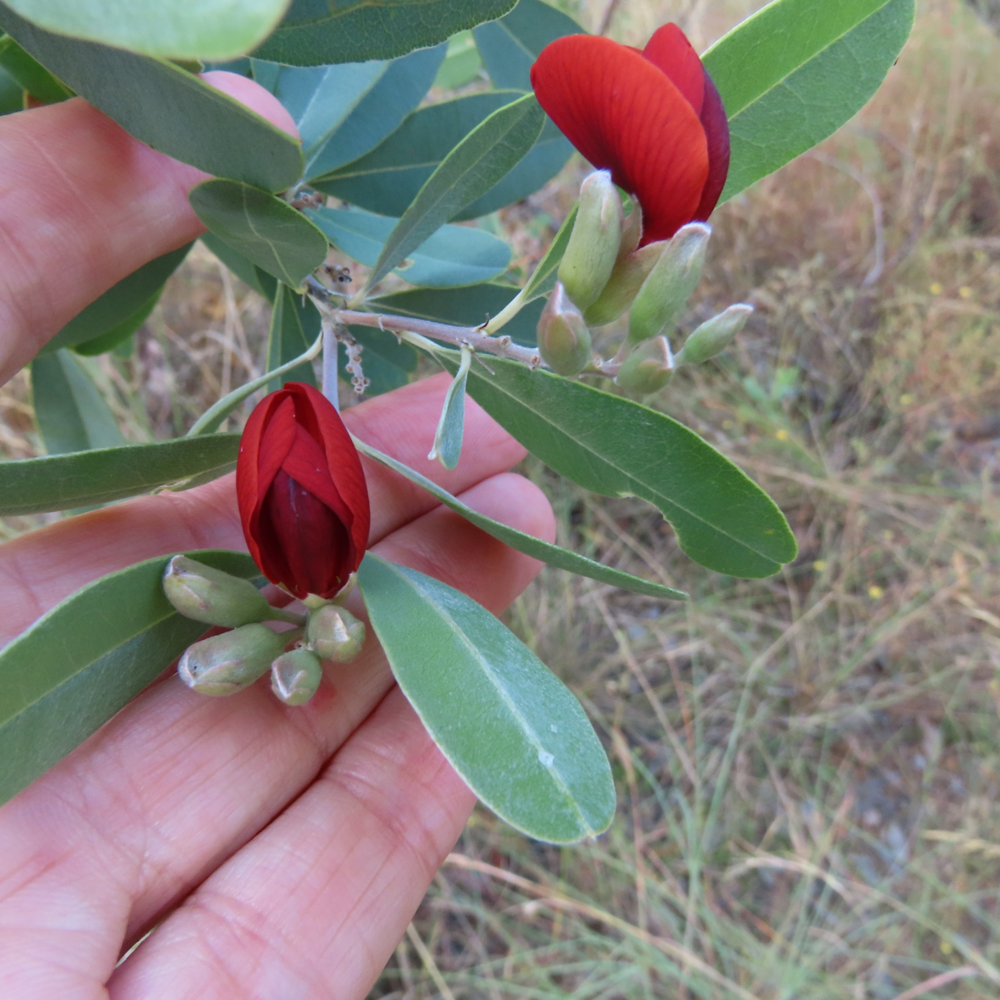
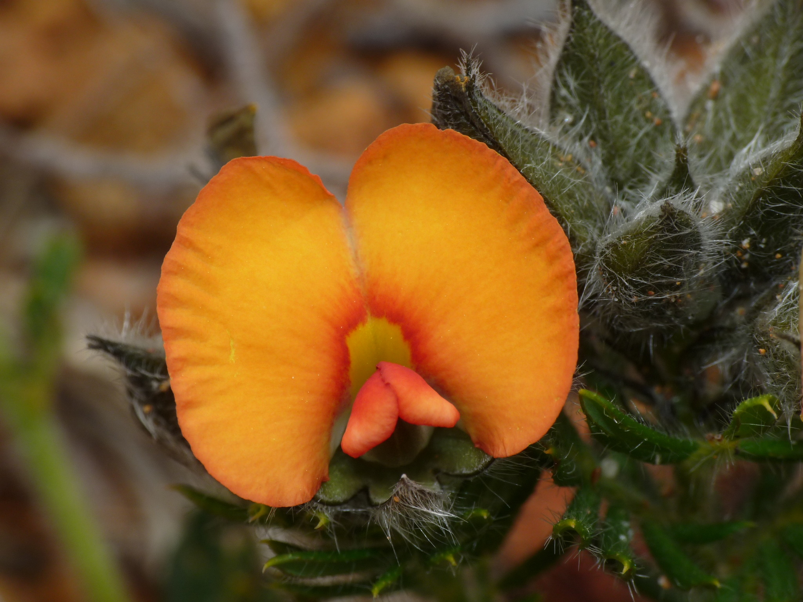

# Assignment 3. Give Peas A Chance! {#chap23}

## Introduction

There are a lot of species of peas. Not just the ones you buy frozen from the supermarket. Peas are legumes (Family Fabaceae) and the Pea family is the third largest family of flowering plants. There are many species endemic to Australia, with the Southwest of Western Australia a hotspot for pea diversity. Western Australian peas are also of commercial interest in that they have been responsible for stock losses due to the accumulation of the plant secondary metabolite, monofluoroacetate, in their leaves. Monofluoracetate is the active ingredient in the agricultural poison, 1080. WA
endemic herbivores are immune to the effects of 1080, due to the long history of coevolution with these pea species.

Of further interest is that the structure of some pea flowers look adapted for pollination by birds, while other close relatives appear to be adapted for insect pollination, predominantly bees. Traits that are associated with bee pollination include orange-yellow petals, and a "platform" that bees can land on in order to enter the flower. Traits associated with bird pollination include red petals, and no platform for insects entering the flower. 

A bird-pollinated pea from WA.

A bee-pollinated pea from WA.

The identification of specific pollination "syndromes" (insect *versus* bird *versus* mammal) has been a topic of scientific interest since Darwin's time, as a thorough understanding of pollination syndromes provides evidence for adaptive evolution. Recent studies have supported this view. [See this review](./syndromes.pdf) for a meta-analysis of the pollination syndrome problem, and [this book chapter](./GroomLamont2015.pdf) for a discussion of the Western Australian flora.

## Your Task

Recently an interesting data set came across my desk. Researchers surveyed different species of bird- and bee-pollinated peas in Western Australia and counted the number of seeds (peas) in a sample of pods (actually, "funicles") with multiple samples from many plants from several species on several mountains. The hypothesis underlying the study was that different pollination syndromes would have different levels of seed production (ie different biological "fitness"). It was also of interest to compare the fitness of the "intermediate" pollination syndrome ie. flowers having some bird- and some bee-pollinator traits. Although these were the initial reasons for gathering the data, the dataset is complex and can be analysed from many different angles. Your task is to analyse this data set and test the researcher's hypotheses, as well as develop some of your own and test those too. You will need the skills that you have developed from previous weeks, including the use of GLMs and LMEs. The recent material on Generalised Linear Mixed-Effects Models (GLMMs) should be of special interest to you.

### Marking Scheme
The marking scheme and the items you need to hand in will be the same as for the previous assignment. Please refer back to Chapter 19 for further information. I am interested in the questions you ask of the data, as well as your attempts to answer them. Note that this is __real data__ and it is currently being studied by researchers in the School of Biological Sciences. In order to preserve the researchers' intellectual property, species names have been changed to de-identify the data. The data are in some ways messy, so there will probably need to be some cleaning up before your final analyses. Except for the species names, this was how the data were sent to me. You can download the data file [here](./Peas.xlsx).

## Due Date

This assignment will be due on __Friday 20th May at 1400__ (as per the ECP). The assignment must be submitted using TurnItIn. Any issues with the marking scheme or assessment items can be directed to me (Simone).

