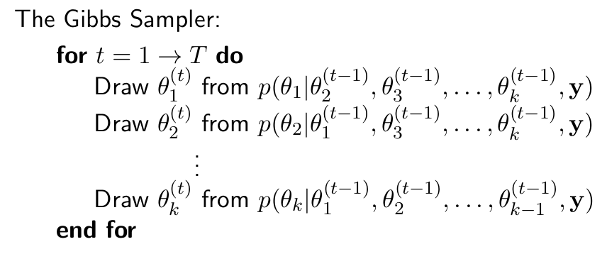
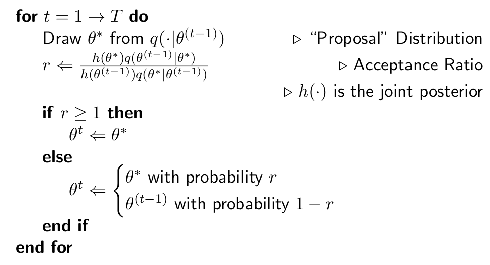

# Bayesian Analysis and Markov Chain Monte Carlo (MCMC) methods {#chap25}

## Why use MCMC methods?

MCMC was developed to solve the problem of ___integration___ of complicated functions which may be difficult  to solve analytically or completely intractable. In our context, we can use MCMC to derive the marginal posterior distributions of parameters, conditional on the data and other parameters in our Bayesian model. To obtain the marginal posteriors, we need to ___integrate___ over these other parameters, which may be "nuisance" parameters or simply other parameters in the joint posterior distribution defined by our model. Modern software such as [BUGS](https://www.mrc-bsu.cam.ac.uk/software/bugs/) and [JAGS](https://mcmc-jags.sourceforge.io/) use MCMC methods. The current "hot" piece of Bayesian software is called [Stan](https://mc-stan.org/) and it uses a more complicated variant, called Hamiltonian Monte Carlo (HMC). HMC uses information about the derivatives of the joint posterior to better search the sample space. As well as plain HMC, Stan also implements a further variant called the, "No U-Turn Sampler" (NUTS). We will not consider these approaches here. Instead, we will look at two simpler examples of MCMC techniques in order to give you an intuitive feel for how MCMC works in general.

## The Gibbs Sampler

For the Gibbs Sampler algorithm, we start off with a "guess" at the parameter values, then we draw from the conditional posterior distribution of each parameter, conditional on the previous values of the other parameters (and the data). We loop around and do this again, many times. The result is the marginal posterior distribution of each model parameter. In order to implement the Gibbs Sampler, we need to be able to specify the conditional distributions of each parameter. This can be difficult. However, it is fast and converges quickly so it is a good method to use if you can. The algorithm is:



## Example: The Bent Coin (again!)

Consider the following model of a bent coin tossed a random number of times. We are interested in estimating the expected number of times the coin was tossed($\bar{n} = E(n \mid y)$) and the degree of "bend" in the coin (the bias) $\bar{p} = E(p \mid y)$ $y$ are the data: the number of "heads" that were observed:

\begin{align}
(y \mid n, p) &\sim Binomial(n, p) \\
(p|n) &\sim Beta(a, b) \\
n &\sim Poisson(m)
\end{align}

The likelihood and priors are therefore:

\begin{align}
(y|n, p) &\sim Binomial(n, p) \\
\Rightarrow f(y|n, p) &= {n \choose y} p^y(1-p)^{n-y}, \qquad y=0,\dots, n \\
(p|n) &\sim Beta(a, b) \\
\Rightarrow f(p|n) &= \left[\frac{\Gamma(a+b)}{\Gamma(a)\Gamma(b)}\right]p^{a-1}(1-p)^{b-1}, \qquad 0 < p < 1 \\
n &\sim Poisson(m) \\
\Rightarrow f(n) &= \frac{m^n e^{-m}}{n!}, \qquad n = 0, 1, 2, \dots
\end{align}

Using Bayes’ Theorem, we construct the joint posterior:

\begin{align}
f(n, p|y) &\propto f(n)f(p|n)f(y|n, p) \\
&=\frac{m^n e^{-m}}{n!}\left[\frac{\Gamma(a+b)}{\Gamma(a)\Gamma(b)}\right]p^{a-1}(1-p)^{b-1}{n \choose y} p^y(1-p)^{n-y} \\
&\stackrel{n, p}{\propto}\frac{m^n}{n!}p^{a-1}(1-p)^{b-1}{n \choose y}p^y(1-p)^{n-y} \\
&=\frac{m^n}{(n-y)!}p^{a+y-1}(1-p)^{b+n-y-1}
\end{align}

## Marginal Posterior for $n$

By inspection of the joint posterior distribution, the conditional p.d.f. of $n$ given $y$ and $p$ is:
\begin{equation}
f(n|p,y) \propto \frac{m^n}{(n-y)!}(1-p)^n
\end{equation}
since $p$, $y$, $a$ and $b$ are constants. $f(n|p, y)$ can be expressed as a Poisson p.d.f.:
\begin{equation}
f(n|p,y)=\frac{e^{-m(1-p)}[m(1-p)]^{n-y}}{(n-y)!},\quad n= y, y+1,\dots
\end{equation}
Letting $w=n-y$,
\begin{equation}
(w|y,p) \sim Poisson(m(1-p))
\end{equation}
We can then therefore sample $w$ from a Poisson distribution and then obtain $n=w+y$.

## Marginal Posterior for $p$

Again, by examining the joint posterior derived above:

\begin{equation}
f(p|n, y) \propto p^{a+y-1}(1-p)^{b+n-y-1}
\end{equation}
and so $(p|n, y) \sim Beta(a+y, b+n-y)$. We now have the two conditional distributions for $p|n,y$ and $n|p,y$. We can now implement the Gibbs sampler.

## R code for the Gibbs Sample (Bent Coin)
Exercise: Run the code for yourself. Experiment with different priors and different starting values etc.
```{r}
BBPGibbs <- function (y=10, m=12, a=3, b=3, p=0.5, n=20, burnin=1000, J=10000) {
its <- burnin + J
pvec <- vector("numeric", length=its)
nvec <- vector("numeric", length=its)
pvec[1] <- p ## starting value
nvec[1] <- n
for (j in 2:its) {
nvec[j] <- rpois(1, m*(1 - pvec[j-1])) + y
pvec[j] <- rbeta(1, y + a, nvec[j-1] - y + b)
}
pburn <- pvec[1:burnin]
nburn <- nvec[1:burnin]
pkeep <- pvec[(burnin+1):its]
nkeep <- nvec[(burnin+1):its]

pbar <- mean(pkeep)
nbar <- mean(nkeep)
psd <- sd(pkeep)
nsd <- sd(nkeep)

pCI95 <- pbar + c(-1, 1) * qnorm(0.975) * psd/sqrt(J)
nCI95 <- nbar + c(-1, 1) * qnorm(0.975) * nsd/sqrt(J)

probs <- c(0.025, 0.975)
pCPDR <- quantile(pkeep, probs=probs)
nCPDR <- quantile(nkeep, probs=probs)
list(nburn=nburn, pburn=pburn, nkeep=nkeep, pkeep=pkeep,
pbar=pbar, nbar=nbar, psd=psd, nsd=nsd, pCI95 = pCI95,
nCI95=nCI95, pCPDR=pCPDR, nCPDR=nCPDR)
} 
```
## Running the Code
```{r}
res <- BBPGibbs()
as.data.frame(res[5:8])
t(as.data.frame(res[9:12]))
par(mfrow=c(2,2))
plt <-  mapply(function (x, y) plot(x, main=y, type="l"), res[1:4], names(res[1:4]))
par(mfrow=c(1,2))
plt <- mapply(function (x, y) hist(x, main=y), res[3:4], names(res)[3:4])
```

## The Metropolis-Hastings Algorithm

Frequently we cannot use the Gibbs Sampler because we cannot derive the full conditional distributions, either because they are intractable (perhaps we have used non-conjugate priors) or because we are not good enough mathematicians. The Metropolis-Hastings Algorithm has been developed to sample from the joint posterior to give the marginal posterior for each model parameter:


Note that we do not need to derive the conditional distributions of the parameters. We can just supply the joint posterior without any further manipulation.

## R Implementation for the Bent Coin

```{r}
BBPMH <- function (delta=0.3, delta2=0.55, burn=1000, J=10000, p=0.5, 
n=40, y=10) {
require(extraDistr)
hfun <- function(n, p, m=12, a=3, b=3){
	m^n * exp(-m)/factorial(n) * (gamma(a+b)/				
	(gamma(a)*gamma(b))) * p^(a-1) * (1-p)^(b-1) * 
	choose(n, y) * p^y * (1-p)^(n-y)
}	
its <- burn + J
pvec <- vector("numeric", length=its); pvec[1] <- p
nvec <- vector("numeric", length=its); nvec[1] <- n
ctp <- 0; ctn <- 0           
for (j in 1:its) {
	pStar <- rtnorm(1, mean=p, sd=delta,a=0, b=1)
	r <- hfun(p=pStar, n=n) * dtnorm(p, mean=pStar, sd=delta, a=0, b=1) /
( hfun(p=p, n=n) * dtnorm(pStar, mean=p, sd=delta, a=0,b=1))
	u <- runif(1)
	if (u < r) {
		pvec[j] <- p <- pStar
		ctp <- ctp + 1
	} else pvec[j] <- p
	nStar <- rdunif(1, min=round(n-delta2), max=round(n+delta2))
	r <- hfun(p=p, n=nStar) * ddunif(n, min=round(nStar-delta2),
max=round(nStar + delta2)) /
(hfun(p=p, n=n) * ddunif(nStar, min=round(n-delta2), max=round(n+delta2)))
	u <- runif(1)
	if (u < r) {
		nvec[j] <- n <- nStar
		ctn <- ctn + 1
	} else nvec[j] <- n
}
pkeep <- pvec[(burn+1):its]; nkeep <- nvec[(burn+1):its]
arp <- ctp/its; arn <- ctn/its
list(pkeep=pkeep, nkeep=nkeep, arp = arp, arn=arn)
}
```
## Running the Code:

```{r}
res <- BBPMH()
par(mfrow = c(2, 2))
plot(res$pkeep, main = "pkeep", type = "l")
plot(res$nkeep, main = "nkeep", type = "l")
hist(res$pkeep, main = "pkeep")
hist(res$nkeep, main = "nkeep")
```

You can see that the results are very similar to the Gibbs Sampler.

Exercise: Run the code for yourself. Experiment with different priors, different starting values, etc.