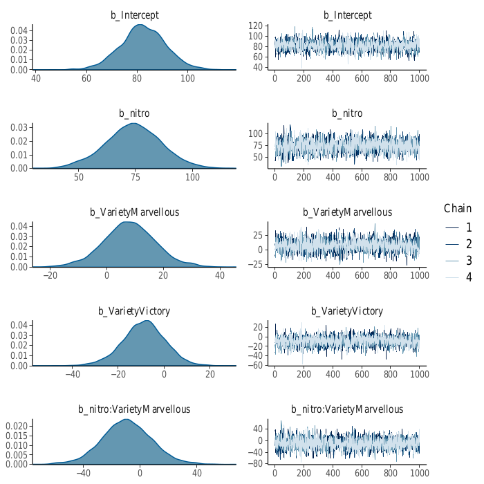
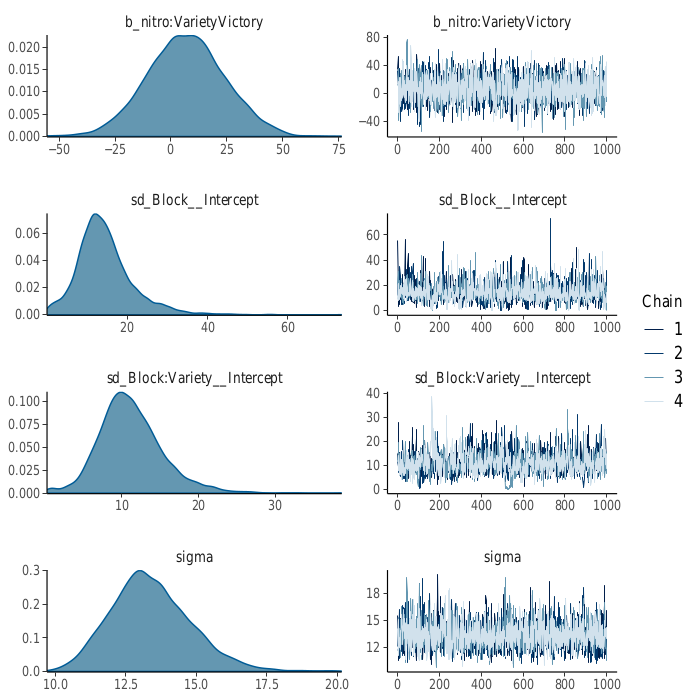
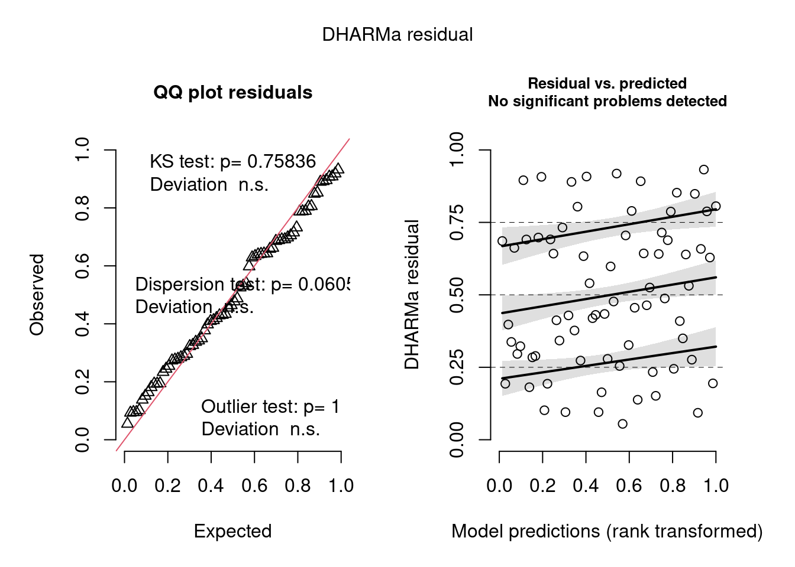

# Bayesian Analysis with brms and Stan {#chap26}

## R packages for Bayesian Analysis

There are many packages for Bayesian analysis in R. See [here](https://cran.r-project.org/view=Bayesian) for a curated list. We will focus on the package ___brms___ as it has a syntax similar to what you have seen befor in fitting LMs, GLMs, LMMs and GLMMs via likelihood methods. brms uses [___Stan___](https://mc-stan.org/) as its back-end. Of course you could use Stan by itself directly. There are also interfaces such as to [Python](https://mc-stan.org/users/interfaces/pystan.html) and [Julia](https://mc-stan.org/users/interfaces/julia-stan.html), as well as a [command-line version](https://mc-stan.org/users/interfaces/cmdstan.html). Stan also has other R interfaces such as [rstan](https://mc-stan.org/users/interfaces/rstan.html). Using Stan directly would allow you to fit a vast array of models that don't fit into the GLMM framework, or extend it in various other ways. There is also a package called [___shinybrms___](https://fweber144.github.io/shinybrms/) which provides a web interface to brms (and hence Stan) which is very nice, but is limited in the distribution families for the likelihood families to the Gaussian, binomial and negative binomial distributions.

## Pathway to the analysis.

As brms is an R package, it provides an interface to Stan that is similar to most other functions such as lm, glm, lmer, glmer, etc. When running brms, the first thing that happens is that brms takes your R code and translates it into code for the Stan language. Then this Stan code is translated to C++ code by Stan. This C++ code is compiled to an executable, which then runs the analysis on your data. This is a roundabout way of doing things, but it seems to work and you can at any stage prefer to edit Stan programs themselves, or even the C++ source code.

## Example: The Rats Data

We will use the rats data from previous sessions. As a reminder, it consists of the numbers of rats exposed to radiation of varying doses, and the number in each group that died. The usual approach would be to model this as binomial data. Here is the analysis using glm in R:

```{r}
dat <- read.csv("rats.csv")
head(dat) ## first 6 lines
fit <- glm(cbind(GroupSize - Died, Died) ~ RadiationDose, data=dat, family=binomial(link=logit))
summary(fit)
```
You should then do some diagnostics etc. But you get the idea. Now the analysis in brms:

```{r message= FALSE}
library(brms)
fit <- brm(I(GroupSize - Died) | trials(GroupSize) ~ RadiationDose, data=dat, family=binomial(link=logit), silent=2, refresh=0)
summary(fit)
```
Here I have used silent=2 and refresh=0 to suppress output for this document. You should try running the code without these two arguments. Notice the different way of specifying a binomial response variable. It is the number that lived out of the total number of trials (GroupSize in this case). This differs from the glm analysis above, where I have used cbind(number lived, number died).

## Specifying Priors

In any Bayesian analysis, it is crucial to specify prior distributions for your parameters. In brms, there are default ("flat") improper priors which should be uninformative in most situations. However, you are free to choose any prior you want and construct it with the "set_prior" function. e.g:

```{r message=FALSE}
pr <- set_prior("normal(0, 0.1)", "b", "RadiationDose")
fit <- brm(I(GroupSize - Died) | trials(GroupSize) ~ RadiationDose, data=dat, family=binomial(link=logit),
           silent=2, refresh=0, prior=pr)
summary(fit)
```

Here we have used a Gaussian prior for RadiationDose with zero mean and standard deviation of 0.1. Most of the probability density is very close to zero, which means that this is strong prior:

```{r}
curve(dnorm(x, 0, 0.1), from=-3, to=3)
```

Note that the posterior estimate of the RadiationDose parameter is closer to zero than if we use the default "flat" prior, and it is also different from the likelihood analysis. Note also that it is not exactly zero, as the posterior value is affected to some extent by the data.

## A "mixed-effects" model

Linear Mixed-Effects models (LMMs) are a commonly used class of models that you have already seen. They consist of predictor variables that may be "fixed" or "random." In a Bayesian context, ___all___ variables are random in that they have distributional assumptions associated with them. In a likelihood context, only the "random" variables have distributional assumptions, usually Gaussians. The fixed effects have no distributional assumptions.

Consider the "split-plot" example from Chapters 20 and 21. We will analyse it using brms, to show the differences and similarities in syntax:

```{r message=FALSE}
library(lme4)
library(brms)
Oats <- nlme::Oats
fit <- lmer(yield ~ nitro*Variety + (1|Block/Variety), data=Oats)
print(fit)
```
```{r eval=FALSE}
fit.brms <- brm(yield ~ nitro*Variety + (1|Block/Variety), data=Oats,
                prior=c(set_prior("normal(0, 100)", class="b"),
                        set_prior("cauchy(0, 10)", class="sd")),
                silent=2, refresh=0, control=list(adapt_delta=0.99),
                cores=4)
print(fit.brms)
```
```{text}
Family: gaussian 
  Links: mu = identity; sigma = identity 
Formula: yield ~ nitro * Variety + (1 | Block/Variety) 
   Data: Oats (Number of observations: 72) 
  Draws: 4 chains, each with iter = 2000; warmup = 1000; thin = 1;
         total post-warmup draws = 4000

Group-Level Effects: 
~Block (Number of levels: 6) 
              Estimate Est.Error l-95% CI u-95% CI Rhat Bulk_ESS Tail_ESS
sd(Intercept)    14.20      7.13     2.11    30.58 1.00     1188     1130

~Block:Variety (Number of levels: 18) 
              Estimate Est.Error l-95% CI u-95% CI Rhat Bulk_ESS Tail_ESS
sd(Intercept)    11.33      4.22     4.30    20.74 1.00      774      978

Population-Level Effects: 
                        Estimate Est.Error l-95% CI u-95% CI Rhat Bulk_ESS
Intercept                  81.99      8.85    64.70    99.15 1.00     2008
nitro                      74.55     11.96    51.28    97.98 1.00     2934
VarietyMarvellous           8.12      9.50   -11.07    26.75 1.00     2520
VarietyVictory             -8.89      9.27   -27.40     9.65 1.00     2611
nitro:VarietyMarvellous    -9.88     17.40   -44.24    23.62 1.00     3274
nitro:VarietyVictory        6.14     17.14   -27.83    39.65 1.00     3044
                        Tail_ESS
Intercept                   2544
nitro                       2998
VarietyMarvellous           2695
VarietyVictory              2733
nitro:VarietyMarvellous     2875
nitro:VarietyVictory        2762

Family Specific Parameters: 
      Estimate Est.Error l-95% CI u-95% CI Rhat Bulk_ESS Tail_ESS
sigma    13.39      1.40    11.06    16.49 1.00     2627     2337

Draws were sampled using sampling(NUTS). For each parameter, Bulk_ESS
and Tail_ESS are effective sample size measures, and Rhat is the potential
scale reduction factor on split chains (at convergence, Rhat = 1).
```

Note that the prior on the "fixed" effects is Normal(0, 100) for each. The prior on the standard deviations of the "random" effects is Cauchy(0, 10). You could choose other priors and it is really down to how to best represent "ignorance" of the true value for each parameter while excluding the possibility of "ridiculous" values. See [this awesome Wiki](https://github.com/stan-dev/stan/wiki/Prior-Choice-Recommendations).

## Diagnostics

The first thing to do is plot the model:

```{r eval=FALSE}
plot(fit.brms)
```

{width="85%"}
{width="85%"}
On the left-hand side of the plots is the posterior density for each parameter. Notice that the "b" parameters (the "betas" in our statistical model) are smooth and almost Normal. The "sd" parameters include the residual standard deviations, and the Block and Variety within Block standard deviations. Notice that they are always positive and somewhat skewed to the right.

On the right-hand side of the plots are the traces for the sampled chains. There are 4 chains in this analysis, represented by different shades of blue. The x-axis is the number of each iteration. There were 1000 in total, after the "burn-in" iterations are discarded. The y-axis is the magnitude of the accepted value at each iteration. If we plotted the histogram of these values, we would get the density curves on the left side of the plots. Note that the traces jump all over the place but there is no trend up or down. Also, there is no "blockiness" which could imply autocorrelation in the samples. In effect, the traces look like a "hairy caterpillar!" This is what we want to see.

There are some model diagnostics in the model output (print(brmsfit)). One is called R-hat and should be 1 or very close to 1. This is a convergence diagnostic and it works on multiple chains. If none of the chains are "wandering" around then convergence is assumed and the R-hat value will be close to 1 (ideally, equal to 1). The other two statistics to look at are the Bulk_ESS and Tail_ESS values. These are measures of the effective sample sizes generated by the analysis and they are affected by the length of the chain (1000 in our case) and the degree of autocorrelation between the samples. As a rule of thumb, we want both of these numbers to be > 200 (preferably at least in the 1000s). If they are not, then you may need to run longer chains, or break up the correlation by thinning.

If there are problems with the traces, we may need to change the analysis to perhaps increase the number of iterations, increase the burn-in, and/or increase the "thinning" interval (ie. choose only every tenth sample to accept, for example).

## Model Diagnostics

As well as assessing the diagnostics from the analysis, we want to determine how well our model fits the data, and how well it compares with other models (model selection and/or model averaging). We can use the DHARMa package to check the model fit:

```{r eval=FALSE}
library(DHARMa)
model.check <- createDHARMa(
  simulatedResponse = t(posterior_predict(fit.brms)),
  observedResponse = Oats$yield,
  fittedPredictedResponse = apply(t(posterior_epred(fit.brms)), 1, mean),
  integerResponse = FALSE)

plot(model.check)
```
{scale=0.9}
The R package bayesplot has further diagnostic functions that you may try.
 