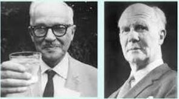
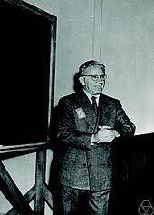
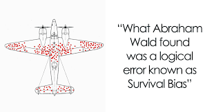

# Experimental Design

## Some History
Sir Ronald Fisher developed the foundations for the rigourous experimental design when he was a researcher at Rothamsted Experimental Station 1919 -1933. Rothamsted was an agricultural field station and there were a lot of studies conducted there on the effectiveness of different fertiliser treatments, for example. On arriving at Rothamsted, Fisher was struck by how badly the analyses of these field trials were conducted. He set about developing the theory of the Design of Experiments and he also developed statistical methods to correctly analyse the results of experiments. We use the principles laid down by Fisher to this day.

Although Fisher had some wrong ideas about eugenics, the genetics of intelligence and racial differences, he was remarkable in that he almost single-handedly invented what we now know as ``classical`` statistics. and __also__ developed the theory of population genetics (along with J. B. S. Haldane and Sewell Wright). He was a giant of 20th century science and an evolutionary biologist at heart. Unfortunately he was rather grumpy and prone to having disagreements and fights with most of his contemporaries. They say you should never meet your heroes and I am glad I never met Fisher. He died in 1962 in Adelaide. His ashes are interred in St. Peters Anglican cathedral in Adelaide. If you go to Adelaide you can visit Fisher's ashes. Put your hand on the plaque and absorb some of Fisher's ``force!``
---

## Experiments

We first consider the simplest experiment: the comparison of two experimental ``treatments.`` What is a treatment? A treatment is some sort of manipulation carried out by a researcher on a group of experimental units. An example might be if we are trying to find out the effect of a drug, we may give the drug to some subjects. To contrast this treatment, we will give a ``placebo`` to another group of people. The delivery of the drug or placebo are both treatments. The experimental units are the subjects in the experiment. 

This simple study has all the properties of an experiment: There is greater than one treatment. (We have 2 treatments, drug and placebo). We are interested in whether the drug works in that the drug treatment is more effective than the placebo, so we can ``contrast`` the treatments. We have performed the experiment a number of times, giving either the drug or the placebo to several subjects. Finally, we do this __at random__, that is, each subject has a probability of 0.5 of receiving either the drug or the placebo. More on the subject of randomness below.

You may have noticed that what we have described is a __randomised, controlled trial__ This is the common term for experiments in the medical field and in the media. Calling a study an RCT is much easier to sell to the general public than an ``experiment``. Subjects generally don't want to be experimented on or treated as guinea pigs so the RCT terminology is used. Statisticians know that we are all talking about ``experiments.'' 

## More terminology

In our example, we can consider the two treatments (Drug and Placebo) to be properties of a unified object, the __factor__. We thus have a factor Drug with two __levels__: drug and placebo. In more complicated experiments, there may be more than one factor in an experiment, and the treatments are combinations of the levels of the different factors. Aside: When Fisher defined a factor, he was thinking about genetics, where different alleles were considered to be different genetic factors. We now use the term ``factor`` in a more general sense, beyond just allelic differences in phenotypes.

The data we take from our subjects during the experiment are called the ``response`` or ``outcome`` variables of the experiment. For our drug example, if we were interested in the effect of the drug on blood pressure, then we would measure the blood pressure of each experimental unit (subject) after applying the drug or placebo. The blood pressure would be the response variable. The factor Drug (with levels drug and placebo) is called the ``explanatory variable`` and is defined by our experimental design. The difference between the effect of the drug treatment and the placebo is called the ``effect size.`` 

The placebo treatment is called a ``control`` treatment. Controls represent a treatment that contains everything about the drug treatment, except the drug itself. A placebo pill contains no active ingredients but application of a placebo can still affect the results (compared to not taking a pill at all) due to the ``placebo effect.`` The effect of taking the drug is thus __isolated__ from all the other factors that might influence the results that occur both in the drug treatment and the placebo control. Any ``effect,`` the difference between the two treatments, must be due to the application of the drug alone.

## Randomness

The role of randomness crops up in two places in experiments. The first is that the experimental units differ in small ways from each other. On one hand we should try to use experimental units (subjects, in our case), that are as uniform as possible to reduce the effects of this randomness. This is the reason for using in-bred lines of rats, mice or rabbits in experiments as they are effectively clones with no genetic differences. They are more uniform, at least in their genetics.

On the other hand, if our experiment is expected to be more ``natural`` we may be interested in running it on a more representative group of experimental units. For example, we may recruit subjects with different backgrounds, body size, gender, age, etc. So that any effects of the drug will be more like the representative effect seen in a clinical setting where lots of different people seek to take the same drug, but respond differently. Such considerations should lead you to think carefully about the hypothesis you are trying to test (more on hypothesis testing below).

The other source of randomness is that deliberately induced by the experimenter: The treatments are assigned to the subjects at random, using a random number generator. The reasoning here is that such random allocation to treatments serves to break up any systematic differences that could possibly occur among subjects. In contrast, any other mechanism for allocating treatments to experimental units has the potential for systematic bias, which will render the experiment useless. An example might be if we ask subjects to arrive at the clinic at various times during the day, and we gave the drug to all the subjects that arrived early in the morning, and the placebo to the subjects who arrived at the clinic late in the day. If, for example, the effectiveness of the drug depended on the time it was taken (e.g. due to circadian rhythm effects), then our experiment would be destroyed because a systematic bias was introduced during treatment allocation. (We say that the drug effect is __confounded__ with the time the drug was taken. Confounding is a big problem and you should really look out for it in the design of any experiment that you do.) Only random application of treatments to experimental units can avoid these systematic biases.

## Positive and Negative Controls

Most control treatments in experiments are usually ``negative`` in the sense that they include all the effects on a treatment, __except__ the one of interest to the researcher. However, there are many situations where we need a ``positive`` control: A treatment where an effect is guaranteed to be detected. A common example is when biologists are seeking to sequence an unknown gene. In order to make sure the sequencing experiment is working, they include a gene of known sequence. If the experiment can't get the correct result for the known sequence, then it is clear that there is something wrong with the experimental technique.

## Blinding of experiments

Blinding in experiments is a very useful technique for avoiding all sorts of systematic biases. The method is to apply the experimental treatment __without__ the subject knowing what treatment they are being given. So in our example, the researcher gives a pill to the subjects without telling them whether the treatment is the drug or the placebo. Of course, the researcher knows this information so it can be used later in the statistical analysis. An even more sneaky method is the so-called ``double blind`` trial. Here, both the researcher and the subject do not know which treatment is being applied. The information is kept by a third party and only revealed to the experimenter at the time of the analysis when collecting of data is over. Doubly-blind trials are a powerful technique for controlling many sorts of systematic bias that may be inadvertently introduced by the experimenter and the subject. Sometimes it is not possible to perform such trials, however.

## Covariates

Another useful part of an experiment is to collect other data along with the response variable of interest. For example, in our drug experiment, we could collect information on the sex and body size of the subjects, their level of obesity, family history of heart disease etc. These are all of interest and may be important in contributing to the response of the subjects to the drug treatment. Yet, they are not being experimentally manipulated by the researcher. They are simply extra information that can be used in the interpretation of the experiment. They are called ``covariates.`` 

It is important to remember that perhaps the defining feature of an experiment is to __manipulate__ the experimental units in some way. In this way we can distinguish cause and effect. However, it is possible to collect data on a lot of covariates and relate them to some other variable (the presumed ``outcome`` or ``response``) without manipulating the study system and then derive conclusions about cause and effect. Such ``observational`` studies are fraught because they are heavily dependent on the underlying causal model being correct. However, there could easily be other __unmeasured__ variables that are contributing to the outcome, or the measured covariates could be related to each other in complicated ways. Without experimentation, we cannot usually establish cause and effect. (There are some exceptions to this rule but they rely on extra assumptions and are beyond the scope of this course. If you want information about this, ask me in class.) 

## "Natural" Experiments or Natural "Experiments"

Some people talk about "natural" experiments, such as those provided by natural disasters or weather events, when it is assumed that treatments have been applied to the experimental units at random by the mechanism of the extreme conditions. However, the quotes should be around "experiment" not natural, as nobody doubts the naturalness of the event but it is somewhat dubious to consider it as an experiment akin to researcher manipulated studies where treatments have been allocated to experimental units at random. Some systematic bias may have been introduced, of which we are not aware.

## Random effects and Blocking

One particularly useful technique in the design of experiments is the use of __random effects__, also known as __blocking__. The definition of random effects is slightly complicated so we will leave it to a later chapter. Here we will consider two examples, so you get the idea. Returning to our drug experiment, say we wanted the experiment to be quite large (lots of __replicate__ subjects). So we decide to run the experiment at different clinic locations or hospitals. Now, it is possible that different clinics might produce slightly different results (drug effects). This might be due to the fact that subjects that attend one clinic might receive better treatment, more accurate doses of the drug, may live closer to one clinic rather than another. etc. The upshot is that  some clinics will have, on average, higher or lower effect sizes than others. This variability due to the hospital effect leads to the idea of __blocking__, where we assign patients to blocks (clinics) at random to each of the blocks, The treatments (drug and control) are given to subjects who are a member of a particular clinic, and we use the information of which clinic was attended in the analysis. We then consider the variability in the response to __among__ versus __within__ block effects. So ultimately we are able to __model__ the variation due to blocks and account for it as a component of the variation in the experiment. More on this in the chapter on ``mixed-effects models.`` Aside: The term "block" comes from agricultural trials where fields were divided up into blocks, based on the topography of the field.

The second case where random effects and blocking is common is when we take multiple measurements from our subjects. This is called a __repeated measures__ design. In our drug example, we may, in a sense, use each individual as their own control, by first measuring their blood pressure, applying the treatment (drug versus control) and then re-measuring their blood pressure. Here, the "block" is the individual subject. Naturally, some subjects will respond well to the drug, and some not so well. By treating subjects as blocks, we can remove this subject to subject variation and account for it in our analysis. In our simple drug example, we would probably use a __paired t-test__ to test for differences between treatments, within subjects, which is a simple case of a repeated measures analysis.

## Power

I have said previously that we should choose to do our experiment on many experimental units. This is called __replication__. Then each experimental unit is also known as a __replicate__. But how many replicates do we need in each treatment? How big should our __sample size__ be? 

In a series of papers in the early 20th century, Jerzey Neyman and Egon S. Pearson developed a decision-theoretic approach to hypothesis-testing. The theory was later extended and generalised by Abraham Wald.



Neyman, Pearson and Wald.

Wald was one of the first to notice the phenomenon of ``survival bias`` during World War II.


A centrepiece of the Neyman-Pearson approach is the idea of there being two possible types of error when considering rejecting a hypothesis based on data:

|  | $H_0$ False | $H_0$ True |
|---:|---:|---:|
| Reject $H_0$ | Correct | Type I error |
| Accept $H_0$ | Type II error | Correct |

Thus, a rational approach to hypothesis testing will seek to reject a hypothesis if it is false and accept a hypothesis when it is true. The two types of error are rejecting the null hypothesis when it is true (Type I) and accepting the null hypothesis when it is false (Type II). In the Neyman-Pearson theory, it is usual to fix the Type I error probability ($\alpha$) at some constant (often at 0.05, but not necessarily), and then choose a test which minimises the Type II error probability ($\beta$), conditional on $\alpha$. The (null) hypothesis is then either rejected when the associated p-value for the test is less than $\alpha$, or otherwise accepted.

The Neyman-Pearson theory has come under a lot of criticism since its formulation. Although much maligned, it is still used to justify and compare statistical testing procedures, whether or not scientists accept the paradigm for their everyday data analyses. For our purposes, the theory introduces the concept of “power” of a test, where power is defined as P(Reject $H_0 | H_0$ is false). That is, 1 minus the Type II error probability, or $1 − \beta$. (The first person to promote power as a concept was “Student” a.k.a W. S. Gosset, head brewer for the Guinness brewery. (Interestingly, R. A. Fisher (the other main architect of classical statistics) was against the whole idea of power.)

## Factors affecting the Power of a Test
There are several factors affecting the power of a test:

- There is a trade-off between α and β such that greater power can be gained by accepting a less stringent condition for the Type I error. In other words, power is increased when α is increased. The shortcoming of setting a higher α is that Type I errors will be more likely. This may not be desirable.

- Power can be increased by increasing the effect size. The reasoning is that any test will have trouble rejecting the null hypothesis if the null hypothesis is only ``slightly`` wrong. If the effect size of an experiment (such as the difference between a treatment and a control) is large, then it is easier to detect, and the null hypothesis will be soundly rejected.

- The use of covariates or blocking variables can also increase the power of a
test, as ``controlling`` for other, nuisance, variables can make the test more precise.

- Increasing the sample size in an experiment or observational study also increases the power to detect a response.

It is important to carefully consider sample sizes before doing any experimental work. This is because data are expensive to collect, and may involve an appreciable amount of time and money expended by the researcher. Also, especially in medical research, there are ethical issues to consider. Experiments should be designed so that the minimum number of subjects (e.g. rats, dogs, or monkeys) are used in order to arrive at valid scientific conclusions. For these reasons, it is important to take a quantitative approach to maximising power in an experiment and to design experimental protocols that are efficient in their use of resources (subjects).

## Built-in R Functions for Power Analysis
R comes with a wide variety of built-in functions for power analyses.

## Power of the t-test
Recall that one use of the t-test is used to test for differences between two sample means, drawn from two Normal populations with unknown variance. The null hypothesis is that the samples were drawn from a single population. i.e. H0 : the sample means are not different. Examine the help page for power.t.test, part of which is presented below:
```{r, eval=FALSE}
?power.t.test

power.t.test
package:stats
R Documentation
Power calculations for one and two sample t tests
Description:
Compute power of test, or determine parameters to obtain target power.
Usage:
power.t.test(n = NULL, delta = NULL, sd = 1, sig.level = 0.05, 
             power = NULL, type = c("two.sample", "one.sample", "paired"), 
             alternative = c("two.sided", "one.sided"), strict = FALSE)
```
Notice that <tt>power.t.test</tt> accepts 8 ``arguments``. Arguments <tt>type, alternative</tt> and <tt>strict</tt> describe the behaviour of the t-test. That is, whether the test is a two-sample, one-sample, or paired t-test, and whether it is a two-sided or one-sided test. Further, we are given the option of including both tails in the power calculation for the two-sided test, by setting <tt>strict=TRUE</tt>. Note that the default is <tt>strict=FALSE</tt>. The first 5 arguments determine the type of analysis. To use the function, you specify 4 of the first 5 arguments, and the unspecified argument is the one that is output from the computation. Here’s an example:

```{r}
power.t.test(n=6, .2, sd=.1, power=NULL)
```
Note that we have left the sig.level argument at its default (0.05). We have specified the sample size, and the two arguments that contribute to the effect size (delta, the difference between the means and sd, the common standard deviation. More on effect sizes below). <tt>power</tt> was set to NULL, as this is the value we are trying to compute. The output is printed, including the estimated
power (0.88 in this case).

## Effect Sizes

It was mentioned previously that increasing the effect size (the standardised "difference" between treatment groups) results in an increased power. However, calculation of effect sizes varies from test to test, depending on the underlying distribution of the test statistic. Frequently, we do not know the likely effect size that may occur in an experiment. The best approach is then to do a pilot experiment on a small scale to estimate the likely effect size. In the absence of pilot data, Cohen (1988) provides standard measures of effect size, classified as "small", "medium", and "large" for a variety of tests. These effect sizes are built into the ``pwr`` package, using the function ``cohen.ES``. Although these "standard" effect sizes are somewhat arbitrary, they can provide a first guide for sample size estimation. Note, however, that a pilot experiment is the recommended way to estimate effect sizes for an experimental study.

## Power Curves
Calculating specific values of power, sample size or effect size can be illuminating with regard to the statistical restrictions on experimental design and analysis. But frequently a graph tells the story more completely and succinctly. Here we show how to draw power, sample size, and effect size curves using the above functions in R:
```{r}
nvals <- seq(2, 100, length.out=200)
powvals <- sapply(nvals, function (x) power.t.test(n=x, delta=1)$power)
plot(nvals, powvals, xlab="n", ylab="power",
main="Power curve for\n t-test with delta = 1",
lwd=2, col="red", type="l")
```

If we are unsure of our effect size, we can also alter delta to see the effect of both effect size and sample size on power:

```{r}
deltas <- c(0.2, 0.4, 0.8)
plot(nvals, seq(0,1, length.out=length(nvals)), xlab="n", ylab="power",
main="Power Curve for\nt-test with varying delta", type="n")

for (i in 1:3) {
powvals <- sapply(nvals, function (x) power.t.test(n=x, delta=deltas[i])$power)
lines(nvals, powvals, lwd=2, col=i)
}
legend("topleft", lwd=2, col=1:3, legend=c("0.2", "0.4", "0.8"))
```

## References

Cohen (1988) is the classic text for non-statisticians.

Cohen J., 1988. Statistical Power Analysis for the Behavioural Sciences. Routledge, 2nd ed. [Here in the library](https://search.library.uq.edu.au/permalink/f/12kerkf/61UQ_ALMA2182073200003131) 