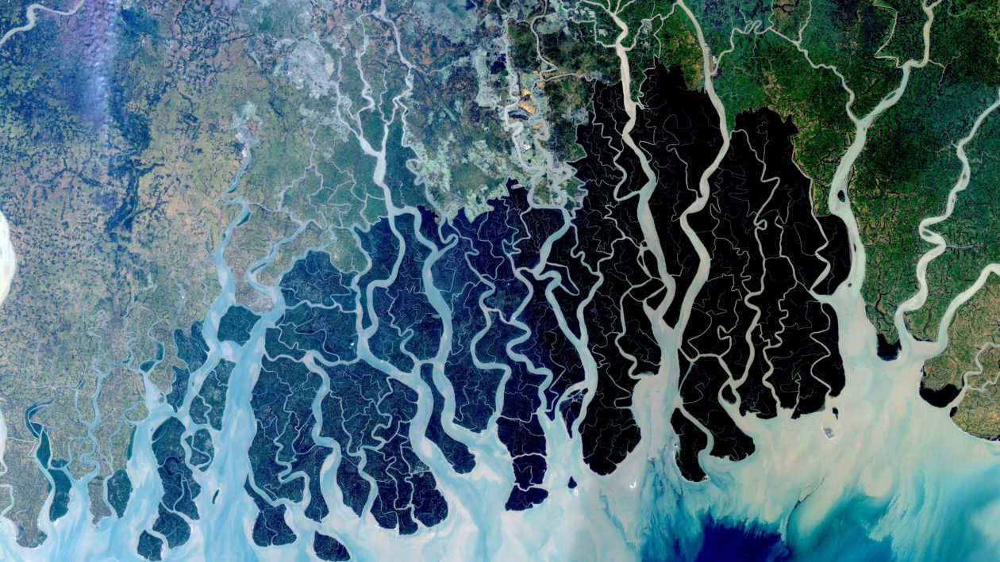

--- 
title: "QBIO7005"
author: "Simon Hart"
date: ""
site: bookdown::bookdown_site
documentclass: book
biblio-style: apalike
link-citations: yes
---

# Welcome to Statistical Modeling in Biology! {-}

{width="120%"} This is a satellite image of the the delta formed by the confluence of the Ganges, Brahmaputra, and Meghna Rivers as they drain into the Bay of Bengal. It's beautiful, huh? But how is this relevant to a course on Statistical Modeling in Biology?

First, there is a lot of biology going on down there. This is one of the most fertile regions on the planet, with immense mangrove forests sequestering enormous amounts of 'blue' carbon, supporting extraordinary biodiversity (genetic diversity, species diversity, ecosystem diversity), and providing food, fuel, and resources for millions of often impoverished people trying to stay fed and healthy in an area particularly vulnerable to the spread of infectious diseases such as malaria and dengue fever. As I said - that is a lot of biology to try to come to grips with.

And second - if you'll allow me to stretch the metaphor - the process of learning and doing statistical modeling can often feel like navigating the many channels of a river delta. You half know where you are starting, you half know where you want to go, it seems like there are lots of paths to take with some much more obscure than others but many of which seem to end up in roughly, but not exactly, the same place, and you are just as likely to get lost or eaten by a Bengal tiger or a saltwater crocodile or someone with a different statistical philosophy as you are to actually find out anything real about our biological world.

Are you ready?

**Before we get started**

Can you please tell us (Simon and Simone) a little about your understanding of statistics? 
\
\
\

<iframe src="https://docs.google.com/forms/d/e/1FAIpQLSdqY-UK_EDaYnYx4MrM3DP6kjSZVWT7fOj8wJLwisWkvMDHZg/viewform?embedded=true" width="640" height="431" frameborder="0" marginheight="0" marginwidth="0">Loading…</iframe>

\
\
This information will only be seen by Simon and Simone, and can be anonymous if you like, but also feel free to sign your name. 